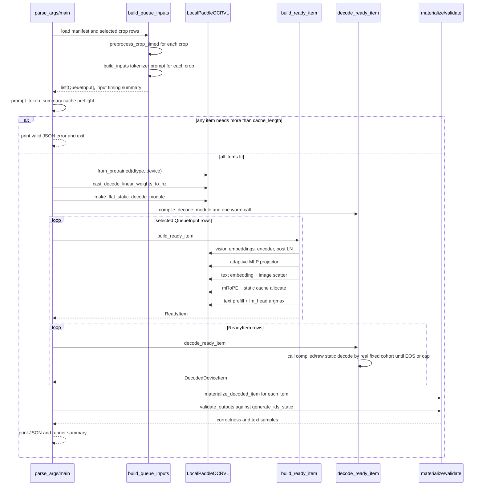

# Experiment 5 Queue Benchmark Flow

`bench_recognizer_queue.py` measures a recognizer-only serving shape for real
OmniDocBench crops that are already selected in `crops/hotswap_100_manifest.json`.
It does not run page layout detection. It does include crop file read/decode,
local PaddleOCR-VL preprocessing, native-resolution vision encoding, adaptive
MLP projection, text prefill, static-cache decode, output postprocess, and
correctness validation.

The queue benchmark supports fixed decode cohorts through `ACTIVE_BATCH_SIZE`.
It stays padding-free: if the final cohort has fewer than `ACTIVE_BATCH_SIZE`
items, the script compiles/wraps and decodes that smaller real cohort shape
instead of adding fake rows.

## Data Flow

## Code Flow

## Main Data Objects

`QueueInput` is host-side prepared data for one crop. It contains the manifest
entry, absolute crop path, prompt, `input_ids`, `attention_mask`, `pixel_values`,
`image_grid_thw`, and CPU input-build timings. The important shapes are:

- `pixel_values`: `[vision_tokens, 3, 14, 14]`
- `image_grid_thw`: `[1, 3]`, with `[grid_t, grid_h, grid_w]`
- `input_ids`: `[1, prompt_tokens]`
- `attention_mask`: `[1, prompt_tokens]`

`ReadyItem` is device-side state after vision/projector/prefill. It contains the
per-item static cache, `rope_deltas`, `next_cache_position`, first `next_token`,
stage timings, `vision_tokens`, and `projected_image_tokens`. For this model,
projected image tokens are normally `vision_tokens / 4` because the adaptive MLP
connector performs a 2x2 spatial merge.

`DecodedDeviceItem` is the device-resident decode result before CPU
materialization. It keeps a list of one-token tensors so the measured
`decode_queue` phase does not include tokenizer decode or bulk CPU token copies.

`ReadyCohort` is a padding-free batch of `ReadyItem` rows. It concatenates
single-item K/V cache rows, `rope_deltas`, `next_cache_position`, and
`next_token` across batch dimension. The last cohort can be smaller than
`ACTIVE_BATCH_SIZE`.

`DecodedItem` is the CPU-side output after materialization. It contains raw token
IDs, EOS-trimmed token IDs, generated text, EOS/length-cap flags, and
postprocess timing.

## Filters And Hard Checks

The benchmark deliberately fails early instead of silently changing the serving
shape:

- `num_items`, `max_new_tokens`, and `cache_length` must be positive.
- `active_batch_size` must be positive.
- Every selected crop file must exist.
- `cache_length` must cover `input_tokens + max_new_tokens - 1` for every item.
- Image-token count and projected-image-embedding count must match exactly.
- Validation is required by default (`validation_items=-1`) and compares every
  queued output against direct local static generation.
- Token IDs are checked for invalid values outside the model vocabulary.

There is no hidden text padding path in this benchmark. Different crop/prompt
lengths become different ready states, and the decode queue groups those ready
states into fixed real cohorts.

## Timing Buckets

`setup_timing_s` is reported but excluded from throughput. It includes model
load, device-specific decode weight format handling, compile/wrapper creation,
and the first decode call that may trigger compilation or cache load. On NPU,
weight format handling preconverts decoder linear weights to FRACTAL_NZ. On
CUDA, the same step is skipped and reported as such.

`phase_timing_s.input_build_wall` is host-side crop processing and prompt
construction for all selected crops.

`phase_timing_s.ready_bank_build` is sequential per-crop device transfer,
native-resolution vision encoder, adaptive MLP projector, text prefill, and
first-token LM head.

`phase_timing_s.decode_queue` is only the fixed-cohort text decode loop over
already-ready states.

`pipeline_stage_timing_summary_s` is a clearer set of aliases over the existing
timers:

- `vision_prefill`: vision prepare, native-resolution visual encoder, and
  adaptive MLP projector.
- `text_prefill`: text token embedding, image embed scatter, mRoPE/static-cache
  setup, text decoder prefill, first-token LM head, and argmax.
- `text_decode`: the fixed-cohort decode queue.

`phase_timing_s.decode_output_postprocess` is token tensor materialization,
EOS trimming, and tokenizer decode.

`phase_timing_s.validation` is direct static generation used for correctness.
It is not included in throughput.

## Device Differences

On NPU, the decode path uses TorchAir cache compile, IncreFlashAttention,
`torch_npu.scatter_update_` for decode KV writes, and optional overlapped EOS
flag copies on a second NPU stream. Decoder linear weights are preconverted to
FRACTAL_NZ before compile.

On CUDA, TorchAir and `torch_npu` operators are not used. The same local model
falls back to manual attention and per-row KV cache writes. Use `raw_eager` for
the closest correctness smoke, or a regular `torch.compile` backend such as
`inductor` for CUDA compiler smoke. CUDA numbers are useful for debugging the
Python/data flow, but they are not Ascend throughput evidence.
