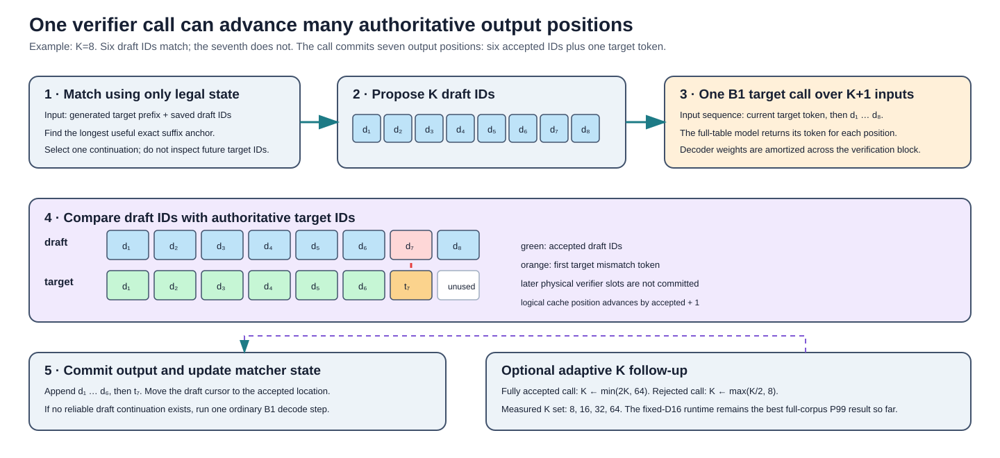
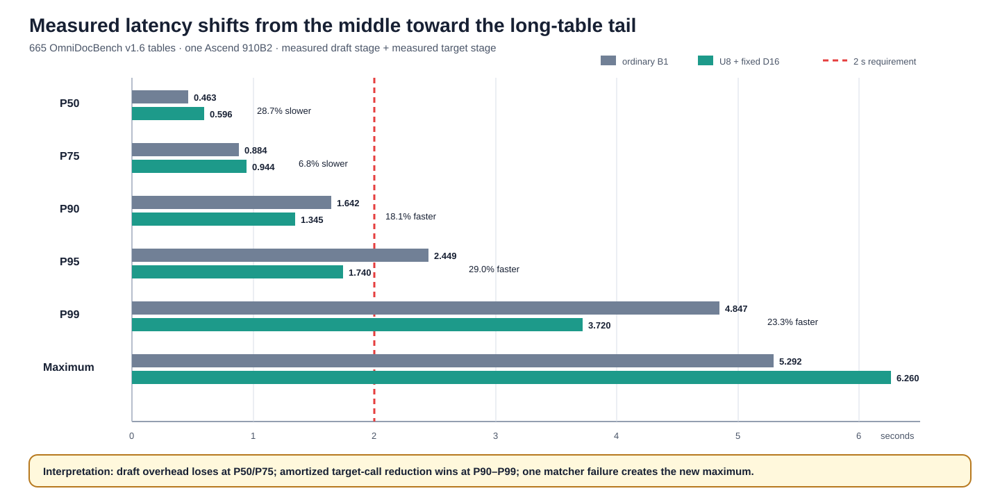

# PaddleOCR-VL latency on Ascend 310P3

### 1. Measured end-to-end result

We created our custom PaddleOCR-VL 1.6 e2e page pipeline, and evaluated on **OmniDocBench v1.6** using **1 x Ascend 310P3**.

The measured full-benchmark result was:

| Metric                    | Result |
|---------------------------|---:|
| Dataset                   | OmniDocBench v1.6 |
| Pages                     | 1,651 |
| Hardware                  | 1 × Ascend 310P3 |
| Concurrency               | ×64 |
| End-to-end throughput     | **0.7 pages/s** |
| Text-block Edit Distance  | 94.9 |
| Table Page-TEDS           | 94.4 |
| Formula Page-CDM          | 97.4 |
| Official Overall accuracy | **95.59** |

Although **throughput** is 0.7 page/s, this does not mean **e2e latency** per page is `1 / 0.7 = 1.43` seconds.

### 2. Latency is not throughput

Concurrency is good for the throughput metric. If you give us 70 pages, we will return OCR in <=100 seconds for all of them. However, each page may return at for example 30s, 60s, 80s. This would mean >>10s latency per page.

### 3. CBG latency requirement

The CBG team requested:

> **P99 table latency below 2 seconds.**

The measurement would be all **tables** (not pages) from OmniDocBench v1.6.
To evaluate this requirement, we must first know how many output tokens each table needs.

The following distribution comes from all **665 table crops** in OmniDocBench v1.6:

| Statistic | Decode tokens |
|---|---:|
| Minimum | 9 |
| Median | 211 |
| Mean | 402.6 |
| P75 | 451 |
| P90 | 951 |
| P95 | 1,496 |
| P99 | 3,091 |
| Maximum | 3,111 |


### 4. Decode speed required for latency below 2 seconds

If we wanted to achieve P99 <2 seconds, it is clear we need to produce 3000+ output tokens in that time:

$$
\frac{3{,}091\ \text{tokens}}{2\ \text{seconds}}
= 1{,}546\ \text{tokens/second}
$$

The lower percentiles also require high throughput:

| Target | Decode tokens | Throughput required for 2 s |
|---|---:|---:|
| P90 | 951 | 476 tok/s |
| P95 | 1,496 | 748 tok/s |
| P99 | 3,091 | **1,546 tok/s** |

These numbers allow only two seconds for decode. Although decode is the biggest bottleneck - they leave no time for image loading, preprocessing, vision encoding, text prefill, HTTP, scheduling, or result serialization.

### 5. What is theoretically possible?

If we want to minimize latency, we should use 1x concurrency. That way, multiple tables won't fight for the same pipeline resources.

This means we want batch size 1 (B1) decoding.

To understand limits of B1 decoding, we look at the following fact: for one output token, the NPU needs to load all model weights from HBM to L2 cache. So if we know our NPU memory bandwidth, and model size, we can get peak theoretical tok/s for B1 decoding.
> **Note:** Why is memory-transfer the bottleneck, and not matmul-compute? It is a simple matter of truth for all acceleration devices that at B1 compute is much faster than memory transfer, and is never in the critical path.

The NPU hardware bandwidths are:

| Device | Memory bandwidth | Source                                                                                                                     |
|---|---:|----------------------------------------------------------------------------------------------------------------------------|
| Ascend 310P3 | **204 GB/s per processor** | [Atlas 300I Duo specifies 408 GB/s across two processors](https://www.hiascend.com/hardware/accelerator-card?tag=300I-duo) |
| Ascend 910B2 environment | **1.6 TB/s** | [64 GB Atlas 300I A2 specification](https://www.hiascend.com/hardware/accelerator-card?tag=300I-A2)                        |

### 6. Why one output token requires reading the decoder weights

Autoregressive decoding runs the complete decoder once for each new output token.

The exact PaddleOCR-VL 1.6 checkpoint contains:

| Parameters (decoder only) | FP16 weight bytes |
|---------------------------|---:|
| **360,747,008**           | **721.5 MB** |


This gives a simple bandwidth roof:

$$
\text{Peak decode tokens/second}
\leq
\frac{\text{memory bandwidth}}{\text{FP16 decoder weight bytes per token}}
$$

This is an optimistic upper bound. It assumes:

- 100% memory-bandwidth utilization;
- every weight byte is transferred exactly once;
- zero KV-cache and activation traffic;
- zero attention, normalization, RoPE, vector-operation, and argmax cost;
- zero kernel-launch and host overhead.

No real implementation can meet all these assumptions.

### 7. Theoretical peak and measured batch-size-1 decode throughput

#### Ascend 310P3:

$$
\frac{204\ \text{GB/s}}{0.7215\ \text{GB/token}}
= 283\ \text{tokens/s}
$$

#### Ascend 910B2:

$$
\frac{1{,}600\ \text{GB/s}}{0.7215\ \text{GB/token}}
= 2{,}218\ \text{tokens/s}
$$

### Comparison with our results

| Device | Theoretical FP16 roof | Measured B1 decode | Measured fraction of roof | P99 decode time at measured speed |
|---|---:|---:|---:|---:|
| Ascend 310P3 | 283 tok/s | **150 tok/s** | 53% | **20.6 s** |
| Ascend 910B2 | 2,218 tok/s | **750 tok/s** | 34% | **4.12 s** |

Even the impossible 310P3 roof gives P99:

$$
\frac{3{,}091}{283} = 10.9\ \text{s}
$$

The requested P99 throughput of 1,546 tokens/s is:

- **10.3 times** our 310P3 result;
- **5.5 times** the 310P3 physical FP16 roof;
- **2.1 times** our 910B2 result;
- approximately 70% of the "impossible" 910B2 bandwidth roof, before any other work.

## 9. Conclusion

For the current 360.7M-active-parameter FP16 decoder:

- **P99 below 2 seconds is physically impossible on one Ascend 310P3.**
- Ordinary kernel tuning cannot bridge a 5.5× gap beyond the memory-bandwidth roof.
- The current 150 tok/s result already reaches approximately 53% of that ideal roof.
- The current 910B2 path is much faster, but its measured 750 tok/s still gives more than four seconds of P99 decode time before encoder and service overhead.

Meeting the requirement needs a fundamental change, such as:
- speculative decoding;
- using 910B instead of 310P;
- different OCR model;


---

## Addendum A — Table splitting and speculative decoding on Ascend 910B2

This addendum describes the first measured implementation of that fundamental
change. It does not change the 310P3 argument above. All measurements in this
addendum ran on **one Ascend 910B2** and are not 310P3 projections.

### A.1 The idea in one picture


The system runs two OCR paths over the same table:

1. A **draft path** cuts a draft-only copy of the table into `U` full-width
   horizontal bands and recognizes those smaller images through a fast
   continuous schedule.
2. An **authoritative path** prefills the original whole table once at B1. It
   uses the band outputs only as token proposals. The full-table target model
   verifies every proposal before it becomes output.

`U` is the split count. `U8` means eight image bands. A band is not guaranteed
to equal one semantic table row: it can contain a header, several physical
rows, or part of a multi-line row. The measured full-benchmark result below
uses `U8`; `U2`, `U4`, `U16`, and adaptive split counts were separate
experiments.

### A.2 How the row-band draft is made

The splitter uses only table pixels. It does not use ground-truth HTML, row
counts, cell annotations, or future target tokens.

For the measured `U8` path it:

1. rotates the draft-only copy for the 12 known sideways crops;
2. resizes the complete draft table before splitting, so every band keeps one
   common scale;
3. starts with seven uniformly spaced internal cuts;
4. moves each cut to a nearby horizontal rule or low-ink separator;
5. crops eight full-width bands and submits the band requests to one continuous
   B8 draft schedule.

The whole-table target input is unchanged. Rotation, splitting, and boundary
snapping affect only the draft proposal path.

Snapping improved the stitched draft Page-TEDS from `0.498909` to `0.569959`
and raised practical K16 target coverage from `81.95%` to `84.03%` versus the
unsnapped uniform-eight experiment. This was useful, but stitched draft
Page-TEDS is not final-output accuracy. The target model remains authoritative.

### A.3 Exact token IDs are the contract

Each band generation stops with its generated token-ID sequence. The matcher
removes the per-band EOS IDs and concatenates the remaining IDs into a draft
stream. It also retains band and table-structure position metadata.

The speculative path must not do this:

```text
generated IDs → decoded text → stitched text → encoded IDs
```

Tokenization is not generally reversible. Decode-then-encode can change IDs
even when the visible text looks identical. The runtime therefore matches and
verifies the **original generated IDs**. Rendered HTML is used only for human
inspection and scoring.

### A.4 How the matcher finds a continuation

The matcher can see only:

- the target IDs already generated from the whole-table context;
- the precomputed draft IDs and their band/column metadata;
- its current position estimate.

It builds exact suffix indexes for anchor lengths 1, 2, 4, 8, 16, 32, and 64.
At each target call it finds draft locations whose preceding IDs match the
generated target suffix. It then ranks candidates by:

1. exact preceding-anchor length;
2. expected table column and estimated row width;
3. whether the location is ahead of the current draft cursor;
4. distance from the cursor.

The selected location supplies the next `K` draft IDs. If no reliable location
exists, the runtime performs one ordinary B1 target decode step and tries to
anchor again later.

This is a legal online matcher. An oracle that searches future target IDs can
show the remaining opportunity, but it is not an implementable runtime.

### A.5 One speculative verification iteration



For a proposal of `K` draft IDs, the verifier executes the target decoder once
over the current target token plus those `K` IDs. It then compares the proposed
IDs with the target model's IDs from left to right.

- If the first `a` proposal IDs agree, those `a` IDs are accepted.
- At the first mismatch, the runtime emits the target model's token, not the
  draft token.
- A fully accepted proposal also emits the verifier's next target token.
- The logical KV position advances only by the accepted prefix plus that one
  target token. Physical verifier writes after a rejection are outside the
  committed prefix and are masked or overwritten before use.

Therefore one target call normally advances `accepted + 1` output positions.
Ordinary B1 decode advances only one.

The first runtime used fixed `D16`: every proposal contained up to 16 draft
IDs. A later adaptive experiment used `K ∈ {8, 16, 32, 64}`, starting at 16:

```text
full proposal accepted  → double K, up to 64
proposal rejected       → halve K, down to 8
```

Here `D16` and `K16` both denote a 16-token draft-verification block. `U8`
describes image splitting; it is independent of `K`.

### A.6 Why this can exceed ordinary B1 decode throughput

Ordinary B1 autoregressive decode reads approximately 721.5 MB of FP16 decoder
weights for each output token. A multi-token verifier still runs the same
decoder, but one weight pass operates on several proposal positions. When many
draft IDs are accepted, the weight-read cost is amortized over several output
tokens.

This does **not** make draft tokens free. Total table latency is:

$$
T_{spec} = T_{draft\ image+prefill+decode} + T_{target\ prefill+verification}
$$

Speculation wins only when the saved target calls cost more than the complete
draft stage. This is why long tables improve first, while short tables often
become slower.

### A.7 Measured full-benchmark result: fixed D16

This is the best measured **full-665-table P99** result so far. It used snapped
and rotated `U8` drafts, a column-aware exact matcher, B1 whole-table target
prefill, fixed D16 verification, and ordinary B1 fallback.

| Target-runtime metric | Ascend 910B2 result |
|---|---:|
| Tables | 665 |
| Ordinary target tokens | 267,413 |
| Target calls after speculation | 41,896 |
| Target-call reduction | **6.383×** |
| Accepted draft tokens | 225,517 |
| Accepted tokens per speculative call | 6.150 |
| Accepted / proposed | 39.19% |
| Measured target prefill + decode | 239.07 s |

The table below adds measured draft generation to measured target runtime. No
ideal token-rate model is used.

| Per-table latency | Ordinary B1 | U8 + fixed D16 | Change |
|---|---:|---:|---:|
| P50 | 0.463 s | 0.596 s | 28.7% slower |
| P75 | 0.884 s | 0.944 s | 6.8% slower |
| P90 | 1.642 s | 1.345 s | **18.1% faster** |
| P95 | 2.449 s | 1.740 s | **29.0% faster** |
| P99 | 4.847 s | **3.720 s** | **23.3% faster** |
| Maximum | 5.292 s | 6.260 s | 18.3% slower |



The full corpus took `498.86 s` with ordinary B1 and `522.14 s` with the
composed speculative path. This is `0.955×` baseline throughput, or 4.7% more
total time. Speculation was faster for 246 of 665 tables. The `283.07 s` draft
stage dominates short tables; the tail benefits because target-call reduction
amortizes that fixed work on long outputs.

Accuracy remained close to the ordinary target run:

| Accuracy metric | Ordinary B1 | U8 + fixed D16 | Delta |
|---|---:|---:|---:|
| Token-exact tables | 665 / 665 reference | 661 / 665 | -4 |
| Page-TEDS | 0.948580 | 0.948345 | -0.000236 |
| Structure Page-TEDS | 0.973811 | 0.973466 | -0.000345 |

The four token differences were repeatable numerical choices between
multi-token PromptFA verification and ordinary one-token IncreFA, not a
decode-encode stitching error.

### A.8 Adaptive K and adaptive U: what improved, and what did not

The all-665 `U8` adaptive-K follow-up increased accepted/proposed from 39.19%
to **48.77%** and improved target-call reduction from 6.383× to **6.861×**.
However, it did not improve composed latency:

| Metric | Ordinary B1 | U8 + adaptive K |
|---|---:|---:|
| Corpus total | 498.86 s | 526.00 s |
| P90 | 1.642 s | 1.359 s |
| P95 | 2.449 s | 1.729 s |
| P99 | 4.847 s | 3.840 s |
| Maximum | 5.292 s | 6.401 s |

It produced 38,973 target calls, but 23,355 of them used K8. Larger verifier
graphs also have different costs. Fewer target calls and higher acceptance do
not automatically mean lower wall time; the paired wall measurement is the
authority. Fixed D16 therefore remains the best full-corpus P99 result.

The adaptive split-count experiment tried every `U` from 1 through 32, used
only safe snapped boundaries, and reserved extra context for the first/header
band. On the 143 tables whose original B1 latency exceeded one second, the
dense selector chose a mean `U=10.55` (`P50=9`, `P90=19`, maximum 26), crossed
no detected unsafe boundary, and produced a measured **1.110× aggregate
speedup**. Its maximum latency still regressed to 6.747 s, so the experiment's
decision was to keep fixed U8 as the default and retain adaptive U as a research
lane. This cohort result is not interchangeable with the all-665 headline.

### A.9 What the result means for the two-second requirement

The measured approach has already broken the one-target-call-per-output-token
constraint: the fixed-D16 runtime needs 6.383× fewer target calls and reduces
P99 by 23.3%. This validates the mechanism.

It has **not** met P99 below two seconds. The best measured full-benchmark P99
is 3.720 s, and the maximum is worse because a few matcher failures pay both
draft cost and near-ordinary target decode.

The next gains must reduce draft overhead and control bad matches without using
future target information. The most practical directions are:

- bypass speculation for tables too small to amortize draft generation;
- stop or reject runaway row-band drafts;
- improve split-count selection without crossing semantic row boundaries;
- improve legal re-anchoring after formatting or content divergence;
- use matcher confidence to fall back before a pathological tail case grows.

The central result is narrower but important: **table splitting supplies useful
parallel draft work, and block verification converts it into real 910B tail
latency reduction while keeping the whole-table model authoritative.**

### A.10 Evidence

- Fixed-D16 result and accuracy:
  [`TABLE_SPECULATIVE_RUNTIME_RESULTS.md`](TABLE_SPECULATIVE_RUNTIME_RESULTS.md)
- Split and offline simulation history:
  [`TABLE_SPECULATIVE_DECODING_RESULTS.md`](TABLE_SPECULATIVE_DECODING_RESULTS.md)
- Snapping and rotation experiment:
  [`accuracy_lab/TABLE_ROW_SNAP_ROTATION_RESULTS.md`](accuracy_lab/TABLE_ROW_SNAP_ROTATION_RESULTS.md)
- Fixed-D16 runtime artifact:
  `tmp/09_persistent_page_engine/table_spec_decode_full_snapped_kv768_1dfeb9d`
- All-665 adaptive-K artifact:
  `tmp/09_persistent_page_engine/table_u8_adaptive_k_full_665_4734b65`
- Adaptive-U cohort artifact:
  `tmp/09_persistent_page_engine/table_adaptive_cutfit_eval_fd9926e`
