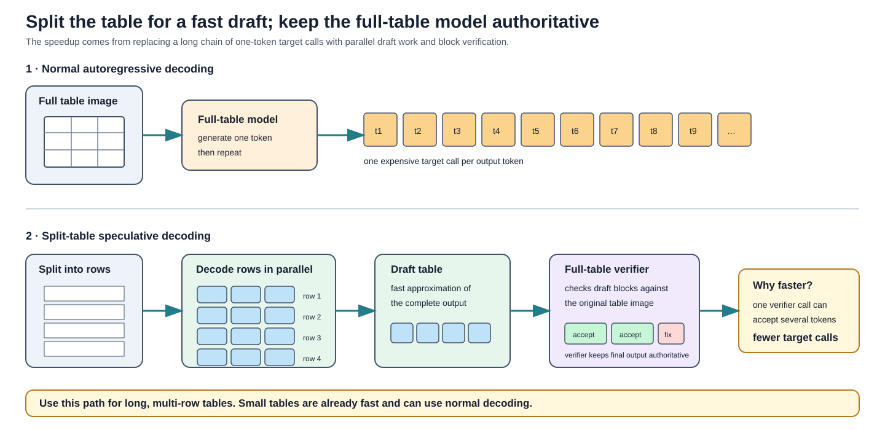

# PaddleOCR-VL latency on Ascend 310P3

### 1. Measured end-to-end result

We created our custom PaddleOCR-VL 1.6 e2e page pipeline, and evaluated on **OmniDocBench v1.6** using **1 x Ascend 310P3**.

The measured full-benchmark result was:

| Metric                    | Result |
|---------------------------|---:|
| Dataset                   | OmniDocBench v1.6 |
| Pages                     | 1,651 |
| Hardware                  | 1 × Ascend 310P3 |
| Concurrency               | ×64 |
| End-to-end throughput     | **0.7 pages/s** |
| Text-block Edit Distance  | 94.9 |
| Table Page-TEDS           | 94.4 |
| Formula Page-CDM          | 97.4 |
| Official Overall accuracy | **95.59** |

Although **throughput** is 0.7 page/s, this does not mean **e2e latency** per page is `1 / 0.7 = 1.43` seconds.

### 2. Latency is not throughput

Concurrency is good for the throughput metric. If you give us 70 pages, we will return OCR in <=100 seconds for all of them. However, each page may return at for example 30s, 60s, 80s. This would mean >>10s latency per page.

### 3. CBG latency requirement

The CBG team requested:

> **P99 table latency below 2 seconds.**

The measurement would be all **tables** (not pages) from OmniDocBench v1.6.
To evaluate this requirement, we must first know how many output tokens each table needs.

The following distribution comes from all **665 table crops** in OmniDocBench v1.6:

| Statistic | Decode tokens |
|---|---:|
| Minimum | 9 |
| Median | 211 |
| Mean | 402.6 |
| P75 | 451 |
| P90 | 951 |
| P95 | 1,496 |
| P99 | 3,091 |
| Maximum | 3,111 |


### 4. Decode speed required for latency below 2 seconds

If we wanted to achieve P99 <2 seconds, it is clear we need to produce 3000+ output tokens in that time:

$$
\frac{3{,}091\ \text{tokens}}{2\ \text{seconds}}
= 1{,}546\ \text{tokens/second}
$$

The lower percentiles also require high throughput:

| Target | Decode tokens | Throughput required for 2 s |
|---|---:|---:|
| P90 | 951 | 476 tok/s |
| P95 | 1,496 | 748 tok/s |
| P99 | 3,091 | **1,546 tok/s** |

These numbers allow only two seconds for decode. Although decode is the biggest bottleneck - they leave no time for image loading, preprocessing, vision encoding, text prefill, HTTP, scheduling, or result serialization.

### 5. What is theoretically possible?

If we want to minimize latency, we should use 1x concurrency. That way, multiple tables won't fight for the same pipeline resources.

This means we want batch size 1 (B1) decoding.

To understand limits of B1 decoding, we look at the following fact: for one output token, the NPU needs to load all model weights from HBM to L2 cache. So if we know our NPU memory bandwidth, and model size, we can get peak theoretical tok/s for B1 decoding.
> **Note:** Why is memory-transfer the bottleneck, and not matmul-compute? It is a simple matter of truth for all acceleration devices that at B1 compute is much faster than memory transfer, and is never in the critical path.

The NPU hardware bandwidths are:

| Device | Memory bandwidth | Source                                                                                                                     |
|---|---:|----------------------------------------------------------------------------------------------------------------------------|
| Ascend 310P3 | **204 GB/s per processor** | [Atlas 300I Duo specifies 408 GB/s across two processors](https://www.hiascend.com/hardware/accelerator-card?tag=300I-duo) |
| Ascend 910B2 environment | **1.6 TB/s** | [64 GB Atlas 300I A2 specification](https://www.hiascend.com/hardware/accelerator-card?tag=300I-A2)                        |

### 6. Why one output token requires reading the decoder weights

Autoregressive decoding runs the complete decoder once for each new output token.

The exact PaddleOCR-VL 1.6 checkpoint contains:

| Parameters (decoder only) | FP16 weight bytes |
|---------------------------|---:|
| **360,747,008**           | **721.5 MB** |


This gives a simple bandwidth roof:

$$
\text{Peak decode tokens/second}
\leq
\frac{\text{memory bandwidth}}{\text{FP16 decoder weight bytes per token}}
$$

This is an optimistic upper bound. It assumes:

- 100% memory-bandwidth utilization;
- every weight byte is transferred exactly once;
- zero KV-cache and activation traffic;
- zero attention, normalization, RoPE, vector-operation, and argmax cost;
- zero kernel-launch and host overhead.

No real implementation can meet all these assumptions.

### 7. Theoretical peak and measured batch-size-1 decode throughput

#### Ascend 310P3:

$$
\frac{204\ \text{GB/s}}{0.7215\ \text{GB/token}}
= 283\ \text{tokens/s}
$$

#### Ascend 910B2:

$$
\frac{1{,}600\ \text{GB/s}}{0.7215\ \text{GB/token}}
= 2{,}218\ \text{tokens/s}
$$

### Comparison with our results

| Device | Theoretical FP16 roof | Measured B1 decode | Measured fraction of roof | P99 decode time at measured speed |
|---|---:|---:|---:|---:|
| Ascend 310P3 | 283 tok/s | **150 tok/s** | 53% | **20.6 s** |
| Ascend 910B2 | 2,218 tok/s | **750 tok/s** | 34% | **4.12 s** |

Even the impossible 310P3 roof gives P99:

$$
\frac{3{,}091}{283} = 10.9\ \text{s}
$$

The requested P99 throughput of 1,546 tokens/s is:

- **10.3 times** our 310P3 result;
- **5.5 times** the 310P3 physical FP16 roof;
- **2.1 times** our 910B2 result;
- approximately 70% of the "impossible" 910B2 bandwidth roof, before any other work.

## 9. Conclusion

For the current 360.7M-active-parameter FP16 decoder:

- **P99 below 2 seconds is physically impossible on one Ascend 310P3.**
- Ordinary kernel tuning cannot bridge a 5.5× gap beyond the memory-bandwidth roof.
- The current 150 tok/s result already reaches approximately 53% of that ideal roof.
- The current 910B2 path is much faster, but its measured 750 tok/s still gives more than four seconds of P99 decode time before encoder and service overhead.

Meeting the requirement needs a fundamental change, such as:
- speculative decoding;
- using 910B instead of 310P;
- different OCR model;


---

## Addendum A — Core idea: split-table speculative decoding



### Normal table recognition

The model receives the complete table image and generates the table one token at
a time. Every new token needs another pass through the full decoder.

For a long table, this creates a long sequential chain:

```text
table image → token 1 → token 2 → token 3 → ... → final table
```

### Split-table speculative recognition

The alternative path uses the visible row structure of the table:

1. Split the table into several horizontal rows or bands.
2. Recognize those smaller images in parallel.
3. Join their outputs into a draft of the complete table.
4. Give that draft to the full-table model for speculative verification.

The draft does not control the final answer. The full-table model still sees the
original image and remains authoritative. It accepts draft content where it
agrees and corrects it where it does not.

### Why it can be faster

Normal autoregressive decoding uses one expensive full-model call for each
output token.

With a good draft, one full-model verification call can accept several output
tokens at once. The work changes from:

```text
many sequential full-model calls
```

to:

```text
parallel row decoding + fewer full-model verification calls
```

The benefit grows with table length. Long, multi-row tables have enough
sequential decoding work to amortize the draft stage. Small tables can bypass
this path and use normal decoding because they are already fast.

The Ascend 910B2 experiments validate the mechanism: the split drafts are useful
enough to reduce the slow-table tail. The remaining engineering task is routing
only the tables that are likely to benefit.

Detailed measurements are recorded in
[`TABLE_SPECULATIVE_RUNTIME_RESULTS.md`](TABLE_SPECULATIVE_RUNTIME_RESULTS.md).
