# Inside Experiment 09

## An illustrated handbook for the persistent PaddleOCR-VL page engine

This book explains Experiment 09 as a system, not as a pile of source files or
an optimization diary. It follows a document page from layout, through
multimodal recognition and continuous decoding, back into an ordered PaddleX
result. Source links are included so the explanation can be checked, but the
architecture—not the current tuning ladder—is the subject.

Experiment 09 is easiest to understand once three different units stop being
treated as if they were one thing:

- A **page** is the document-level unit. It owns layout, reading order, and the
  final artifact.
- A **recognition request** is the model-level unit. It owns one crop, one
  prompt, one multimodal prefix, and one generated result.
- A **decode slot** is the physical execution unit. It is one row in a fixed
  compiled batch and can serve many requests over time.

The entire design follows from allowing those three lifetimes to meet without
collapsing into one page-sized batch.

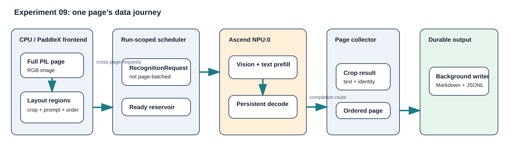

The system keeps PaddleX responsible for the document semantics it already
knows how to implement. It replaces only PaddleX's synchronous recognition
drain with a persistent local recognizer. The recognizer can therefore combine
work from different pages, while completed text still returns to the exact
PaddleX block that requested it.

### Reading map

| Part | Central question |
| --- | --- |
| I. The system outside the model | How do pages become independent requests without losing document ownership? |
| II. From crop to decode-ready request | How do pixels and a prompt become the first token and a KV prefix? |
| III. KV ownership and continuous decode | How can a fixed compiled batch serve a changing request population? |
| IV. Returning to document semantics | How do unordered crop completions become faithful page artifacts? |
| V. Concurrency and observability | What overlaps, what waits, and how can we tell? |
| VI. Architectural boundaries | Which ideas are structural, and which are replaceable policies? |

---

## Part I — The system outside the model

### 1. What is resident, and where

One Python process owns both models on one Ascend NPU:

```text
PP-DocLayoutV3             PaddleOCR-VL recognizer
layout and reading order   vision tower + text model + persistent decode
```

They do not form one neural network. Layout produces document regions. The
recognizer consumes region crops. Their important connection is a bounded
stream of Python request objects, not a hidden tensor edge.

The long-lived runtime also owns:

- a one-page handoff queue between the page producer and recognizer;
- one background CPU preprocessing worker;
- a dedicated prefill H2D stream;
- compiled vision, text-prefill, and decode graph caches;
- a zero-once prefill KV arena;
- a fixed B-row decode arena;
- a two-row pinned host ring for sampled tokens;
- a bounded single-worker page artifact writer.

Setup creates these structures before the measured page run. Model loading,
TorchAir cache loading or compilation, weight-format conversion, and zeroing
the prefill KV arena are setup costs rather than per-page work.

### 2. The page frontend is sequential but asynchronous

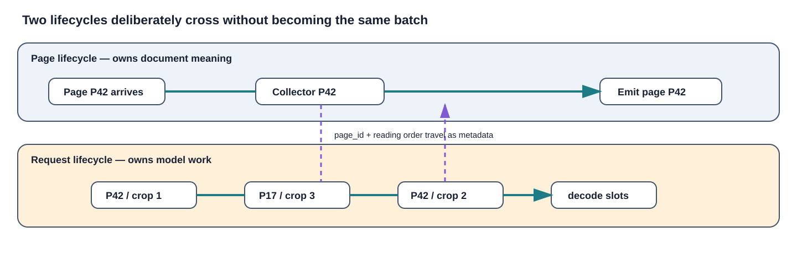

The faithful entrypoint is
[`scripts/run_omnidocbench_paddlex.py`](../scripts/run_omnidocbench_paddlex.py).
It constructs the official PaddleOCR-VL v1.6 PaddleX pipeline, but points its
VLM client at an unused local endpoint. The
[`PaddleXPageBridge`](../pipeline/paddlex_page_bridge.py) then intercepts the
page-preparation boundary and supplies the prepared crops to the local
recognizer.

The page producer performs this loop:

1. Read exactly one page.
2. Run PaddleX document preprocessing and real PP-DocLayoutV3 inference.
3. Apply PaddleX filtering, reading order, merge, crop, and prompt policies.
4. Capture the page template and its recognition batches.
5. Put one `_PreparedPage` into a `Queue(maxsize=1)`.
6. Start the next page only when that bounded handoff allows it.

The producer has its own thread and NPU layout stream. It fences that stream
before publishing the prepared page, so the consumer never sees half-finished
layout state. This is asynchronous page production, not concurrent execution
of multiple layout pages.

The one-page queue is deliberate. An unbounded page producer would accumulate
images, crops, and ownership state. A fixed eight-page or thirty-two-page
cohort would create artificial scheduler boundaries. A single rolling page
gives the next page a chance to arrive while keeping backpressure immediate.

### 3. Page ownership and request ownership

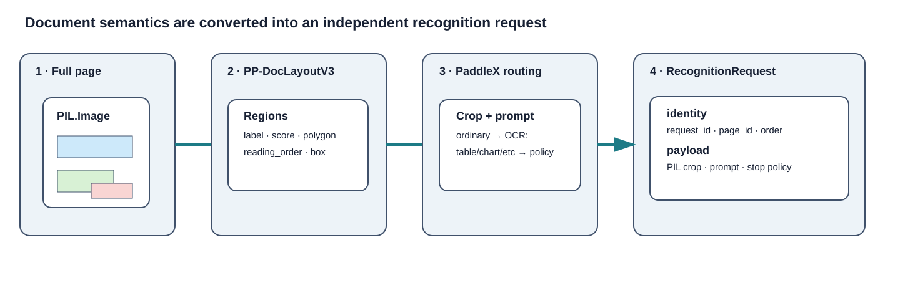

PaddleX groups recognizer inputs by pixel profile. For every crop, the bridge
creates a `RecognitionRequest` containing only the model-facing payload:

```python
RecognitionRequest(
    request_id,
    crop,                 # PIL RGB image
    prompt,
    skip_special_tokens,
    min_pixels,
    max_pixels,
)
```

The page relationship stays in a separate `_RequestOwner` map:

```text
request_id
  -> page state
  -> pixel profile and index within the PaddleX batch
  -> block id
  -> global request order
```

That separation is the reason cross-page scheduling is safe. The recognizer
does not need to know what a page is. It emits a crop result as soon as the crop
finishes. The bridge uses `request_id` to recover the correct page, batch, and
block.

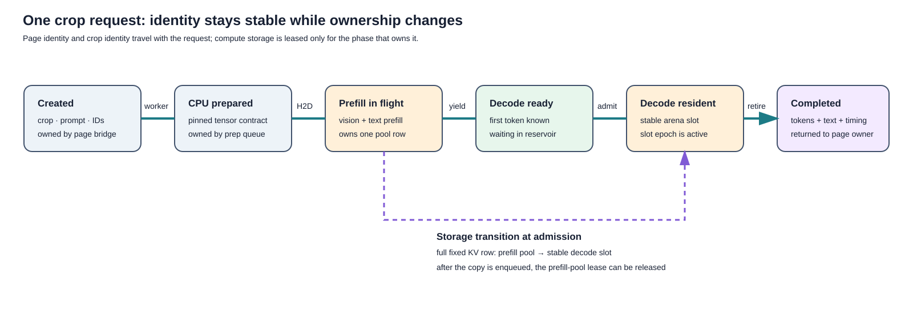

The request state machine is more informative than a call graph:

1. **Submitted** — a PIL crop and prompt exist.
2. **CPU prepared** — the crop has tensors, prompt tokens, and MRoPE positions.
3. **Prefill in flight** — H2D and the vision/text prefix chain are queued.
4. **Decode ready** — the first token and a private KV row exist.
5. **Resident** — the KV row has been admitted into one stable decode slot.
6. **Complete** — EOS or the generation limit was observed on the host.
7. **Routed** — text has filled its original PaddleX block.

The page can finish in a different order from input pages, and crops can finish
in a different order from submission. Only the final page assembly restores
document order.

---

## Part II — Turning one crop into a decode-ready request

### 4. CPU preparation makes the tensor contract

One background `ThreadPoolExecutor(max_workers=1)` performs crop preparation.
It is FIFO and bounded by `cpu_preprocess_max_pending`. The worker is refilled
before the consumer yields the completed item, so CPU work for a later crop can
continue while the NPU consumes the current crop.

The CPU worker does four kinds of work:

1. Apply the crop-specific `min_pixels` and `max_pixels` profile.
2. Resize, normalize, and patchify the image.
3. Expand image placeholders in the task prompt and tokenize it.
4. Build multimodal rotary positions and pin the five transferred tensors.

The core shapes are:

| Object | Semantic shape | Meaning |
| --- | --- | --- |
| `pixel_values` | `[T, 3, 14, 14]` | `T` native-resolution patch rows. |
| `image_grid_thw` | `[1, 3]` | Temporal, grid-height, grid-width metadata. |
| `input_ids` | `[1, S]` | Task prompt with expanded image placeholders. |
| `attention_mask` | `[1, S]` | Real prompt positions. |
| `position_ids` | `[3, 1, S]` | Multimodal rotary axes. |
| `rope_deltas` | `[1, 1]` | Offset needed by subsequent decode positions. |

`T` is the number of 14-by-14 patches before spatial merging. With merge size
two, groups of four vision rows become one projected image token. `S` is the
full text-model prefix length after the image placeholders are expanded.

Before the request may proceed, the worker checks only:

```text
cache_length >= S
```

The prefill-produced first token occupies no additional cache position. Each
later decode graph call writes one more position. Therefore a prompt of length
`S` can return at most `cache_length - S + 1` generated tokens, including the
first token. If it has not emitted EOS by then, the scheduler returns it with
`stop_reason="kv_cache_full"` before launching an out-of-range graph step.

### 5. H2D staging is a pipeline boundary

The prepared inputs are pinned where the runtime supports it. A dedicated
prefill transfer stream copies `input_ids`, `attention_mask`, `pixel_values`,
`position_ids`, and `rope_deltas` with `non_blocking=True`.

The compute stream does not guess when those tensors are ready. The transfer
stream records an event, and the compute stream waits on that event before the
first vision operation.

The one-group lookahead is ordered like this:

```text
submit H2D for group G
enqueue compute for G
submit H2D for G+1 on the host worker while G runs
resolve G and yield its ready requests
enqueue compute for already-staged G+1
```

This overlaps copy submission and transfer with existing work without
pre-enqueueing arbitrary future compute. The ready source is pull-driven by the
decode reservoir, so staging G+1 before yielding G also prevents generator
suspension from delaying the next transfer.

### 6. Vision prefill: pixels become visual features

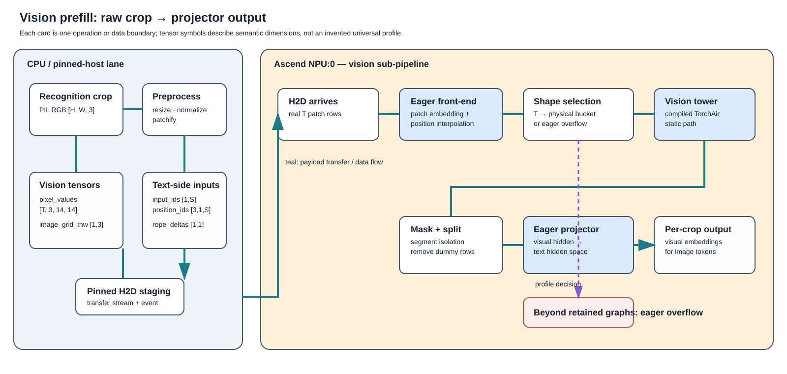

The vision sub-pipeline has three distinct boundaries:

1. **Eager embeddings.** Each crop independently runs patch embedding and
   position interpolation at its real grid.
2. **Vision transformer stage.** Prepared rows run through the 27-layer vision
   encoder and final LayerNorm, either through a static TorchAir graph or the
   same stage eagerly.
3. **Eager projector.** The adaptive MLP merges two-by-two spatial features and
   maps the vision width 1152 into the text width 1024.

Keeping embeddings and the projector outside the static transformer graph is
not an architectural shortcut. Those operations depend on the crop grid and
segment boundaries in ways that are easier to keep faithful outside the fixed
bucket. The expensive repeated transformer block is the compiled boundary.

The PaddleOCR-VL vision configuration used by the local model is:

| Property | Value |
| --- | ---: |
| Vision layers | 27 |
| Hidden width | 1152 |
| Attention heads | 16 |
| Native head dimension | 72 |
| MLP width | 4304 |
| Patch size | 14 |
| Spatial merge | 2 × 2 |

Prompt Flash Attention requires a head dimension divisible by sixteen. The
adapter temporarily pads Q/K/V from 72 to 80 only around the attention call,
keeps the scale derived from 72, and slices the result back to 72 before the
output projection.

### 7. Vision routing and packing

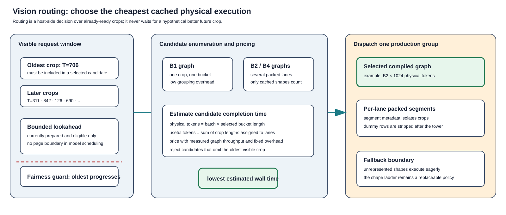

Logical crop lengths and physical graph shapes are different quantities. The
router records both:

```text
real_vision_tokens      useful crop rows
physical_vision_tokens  graph rows actually executed
padding_vision_tokens   physical - real
```

The graph profile can contain multiple sequence buckets and batch sizes. The
router may therefore choose a larger B1 bucket, combine work in a B2 or B4
graph, or use an eager fallback when no retained graph can represent a crop.
It uses a small lookahead over crops that are already prepared; it never waits
merely to make a prettier pack.

Two constraints preserve streaming behavior:

- the oldest visible crop must be included in the chosen route;
- only already-ready crops may be considered.

A route can place multiple independent crops in one physical row, or distribute
them across several batch rows. Segment masks prevent cross-crop attention.
Dummy rows and bucket padding are masked. After the tower, outputs are split by
the recorded real segment lengths and return to per-crop order.

Packing is therefore an execution optimization, not a change in model
semantics. Every crop still has its own projector, text prompt, KV state, stop
condition, and result.

### 8. Multimodal assembly

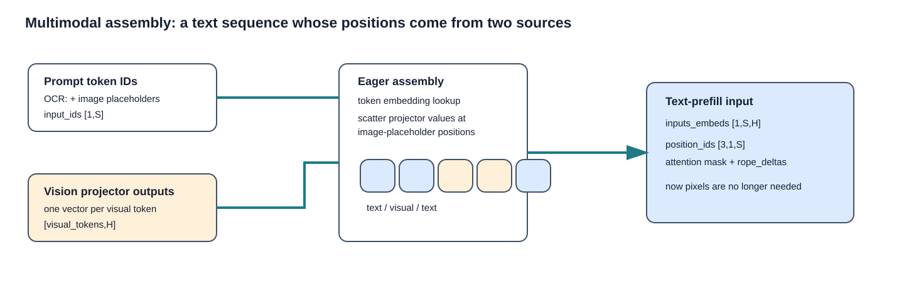

The text decoder never receives raw pixels. It receives one mixed embedding
sequence `inputs_embeds [1, S, 1024]`.

The engine first performs the ordinary text embedding lookup. It then finds the
positions whose token id equals `image_token_id` and uses `masked_scatter` to
replace those embeddings with the projector output. A hard size check verifies
that the number of placeholder positions matches the number of projected
visual tokens.

MRoPE provides three position axes for this mixed sequence. The vision tokens
and text tokens therefore enter one decoder-only transformer prefix; there is
no encoder-decoder cross-attention module in PaddleOCR-VL.

### 9. Text prefill produces the first token and KV prefix

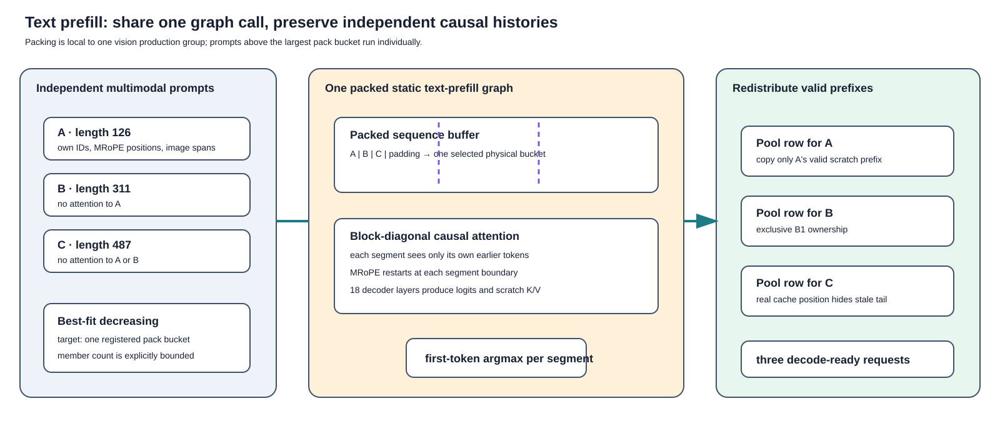

Text prefill runs the 18-layer ERNIE-style decoder over the complete multimodal
prefix. The model configuration is:

| Property | Value |
| --- | ---: |
| Text layers | 18 |
| Hidden width | 1024 |
| Query heads | 16 |
| KV heads | 2 |
| Head dimension | 128 |
| MLP width | 3072 |
| Vocabulary | 103,424 |

The last hidden state passes through the LM head and argmax. That token is the
request's **first generated token**. A request that produces EOS immediately
can complete without entering the decode arena.

With text packing disabled, each prompt uses one B1 bucket or an eager overflow
call. With production-group packing enabled, only prompts already selected
into the same vision production group are considered. Best-fit decreasing
forms packs from the registered text-prefill buckets. MRoPE restarts for every
segment and a block-diagonal causal mask isolates prompts.

The packed transformer writes a scratch KV cache. Each valid segment prefix is
then redistributed into the private pool row leased for that crop. Prompts
larger than the largest pack bucket retain the individual path. This scope
avoids a global all-document pack and preserves the streaming production
boundary.

---

## Part III — KV ownership and continuous decode

### 10. The prefill KV pool: private ownership without per-crop allocation

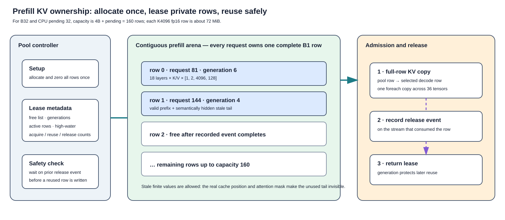

The recognizer does not allocate a new fixed-length cache for every crop.
During setup it allocates one prefill arena:

```text
capacity = 4 × decode_batch_size + cpu_preprocess_max_pending
```

For example, a B32, K4096 profile with 32 pending CPU preparations gives:

```text
capacity = 128 ready rows + 32 production rows = 160 rows
one row   = 18 layers × K/V × [1, 2, 4096, 128] × fp16
          = 72 MiB
arena     = 11.25 GiB
```

The arena is zero-initialized once. A crop leases exactly one B1 view. Text
prefill writes its valid prefix into that view. The request then retains the
lease while waiting in the decode-ready reservoir.

On a reused row, positions beyond the new request's real prefix can contain old
finite KV values. They are semantically invisible: `cache_position` remains the
real prefix length, and the decode attention mask excludes future positions.
This removes repeated zeroing without allowing stale tail state into attention.

Lease return is event-safe. Releasing a row records an event on the current NPU
stream. A later acquisition waits on that event before reusing the row. The
pool also tracks generations, acquisitions, reuses, releases, active rows, and
high-water occupancy; the run asserts that no lease remains active at the end.

### 11. Admission moves a request into a stable decode slot

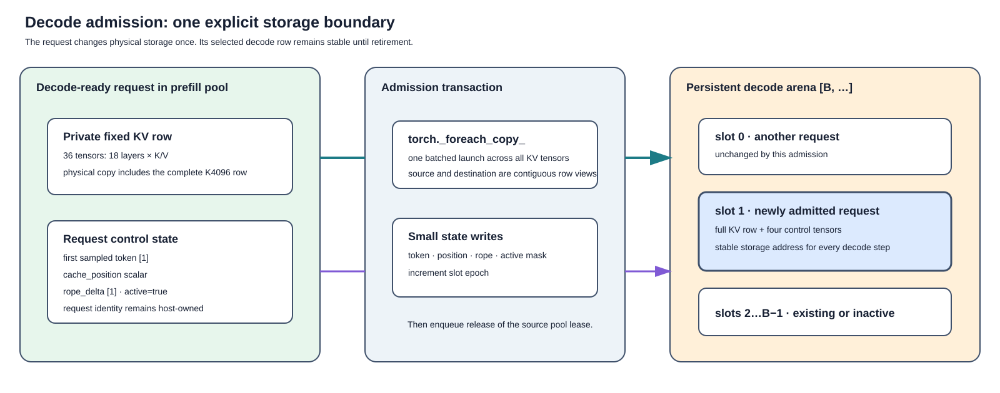

The decode arena is a second persistent cache. It has B rows rather than the
prefill pool's larger queue capacity. Each row is a physical decode slot.

Admission copies all 36 cache tensors—K and V for 18 layers—with one
`torch._foreach_copy_` call from the contiguous B1 pool view into the chosen
decode row. It also copies:

- `rope_deltas`;
- the real `cache_position`;
- the prefill-produced first token;
- the active flag.

The physical copy covers the complete fixed cache row. The useful portion is
only `:prompt_length`; keeping those two byte counts separate matters when
reading metrics. The full copy is fast because every source tensor is
contiguous and the operation is batched. Correctness still comes from the real
cache position hiding the tail.

After the copy is enqueued, the ready request releases its prefill-pool lease.
The decode slot now owns the request's active KV state. The request remains in
that same slot until it completes; unrelated active rows never compact or move.

### 12. Continuous decode keeps graph identities stable

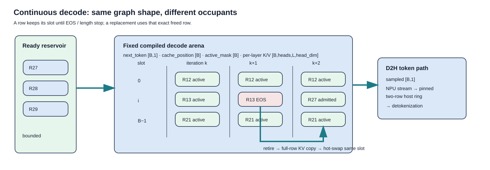

The decode arena owns tensors whose shapes and identities remain stable:

| State | Shape |
| --- | --- |
| `next_token` | `[B, 1]` |
| `cache_position` | `[B]` |
| `rope_deltas` | `[B, 1]` |
| `active_mask` | `[B]` |
| Per-layer K/V | `[B, 2, L, 128]` |

One compiled decode iteration performs token embedding, all 18 transformer
layers with incremental attention, the LM head, and argmax. The model stage may
fuse projections, rotary work, normalization, and residual operations, but
those choices are replaceable implementation policy. The serving architecture
depends only on the fixed state contract and stable tensor identities.

Inactive rows receive EOS sentinels and cache position zero, but they still
occupy physical graph capacity. This creates three different token counts:

```text
raw slots        = graph_calls × B
active slots     = rows occupied when each graph was launched
effective tokens = real post-prefill tokens retained for requests
```

The difference between raw and active is idle capacity. The difference between
active and effective is completion lookahead.

### 13. The sampled-token control loop

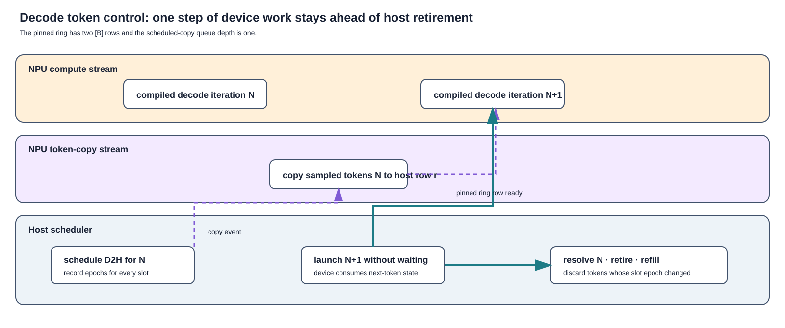

After a decode step, the sampled `[B]` token vector must reach the host so the
scheduler can apply EOS and length rules. A dedicated NPU copy stream waits on
the compute event and copies the vector into `host_token_ring[iteration % 2]`.

The scheduler uses queue depth one:

```text
launch step k+1
schedule D2H for k+1
wait for and consume tokens from step k
retire completed rows from k
admit replacements into those rows
```

This permits one graph call to be in flight before the previous token is
interpreted. Consequently a request can execute one lookahead iteration. Every
slot has a monotonically increasing epoch. A copied token is accepted only if
the slot still has the epoch captured when that graph was launched; a token
from an old occupant cannot affect a newly admitted request.

When EOS or the generation cap completes a request, the scheduler:

1. releases the slot's logical occupant;
2. emits a `DecodeCompletion`;
3. admits the next ready request into that exact row;
4. refills the bounded ready reservoir when it falls below B.

The ready reservoir has capacity `4B` and low watermark `B`. It is filled
lazily from the prefill generator. This makes page boundaries irrelevant to
decode without materializing all crops in the document.

---

## Part IV — Returning to document semantics

### 14. Crop completion becomes page completion

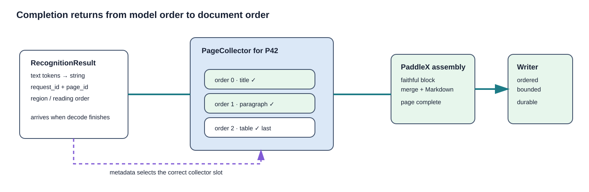

`_result_from_completion` detokenizes the crop's token ids and creates a
`RecognitionResult`. The result records model output plus the evidence needed
to interpret it:

- request and decode schedule identity;
- slot index and epoch;
- prompt, crop size, text, token ids, and stop reason;
- input, projected-image, and generated token counts;
- vision and text route details;
- host timing and NPU-event stage timing.

The bridge removes the corresponding `_RequestOwner`, writes the text into the
correct PaddleX batch entry, and decrements that page's remaining-crop count.
When it reaches zero, PaddleX performs the original parsing-result assembly.
No other page needs to finish first.

Every crop also appends one compact record to `recognition_trace.jsonl`. The
trace is flushed immediately because it is debugging evidence about request
order and route selection. Page Markdown and compact page JSONL use the
background writer described next.

### 15. Durable artifacts are off the scheduler thread

The entrypoint owns one `ThreadPoolExecutor(max_workers=1)` for page artifacts.
It accepts at most eight pending pages. The single worker preserves completion
order while moving Markdown conversion, JSON serialization, and filesystem
writes off the decode scheduler's completion callback.

If storage falls behind, the producer waits for the oldest future before
submitting more. At the end of the model run it drains every pending future.
Therefore E2E wall time means:

```text
first page begins
    ... layout, recognition, assembly, background writes ...
last queued page artifact is durable
```

The writer is not fire-and-forget. Its exceptions propagate, its queue depth
and waiting time are reported, and the official pipeline closes only after the
drain.

---

## Part V — Concurrency, limits, and observability

### 16. What overlaps

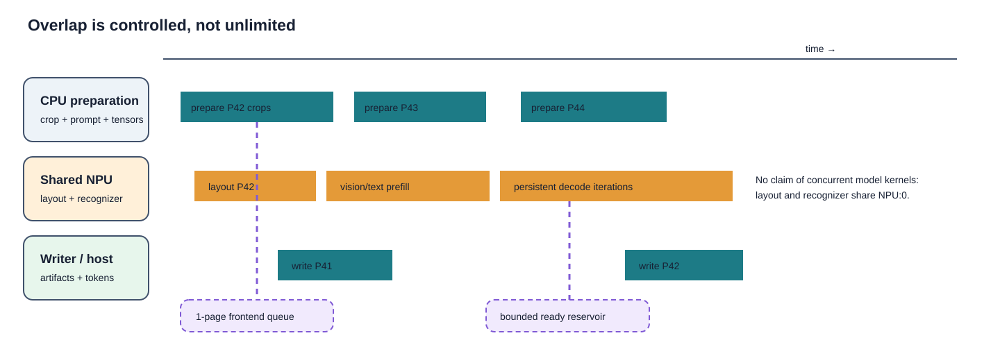

The system has several pipelines, but only one shared NPU:

- The page producer can prepare page N+1 while the recognizer consumes page N.
- The CPU worker can prepare later crops while the NPU runs a current prefill.
- H2D for prefill group G+1 can overlap work associated with G through an
  explicit transfer stream and events.
- Sampled-token D2H uses a separate copy stream.
- Page artifact writes occur on a background host worker.

The architecture does **not** claim arbitrary simultaneous layout, vision,
text-prefill, and decode kernels. Layout and recognition share `npu:0`.
Prefill and decode both use the recognizer compute stream. Host concurrency and
copy streams prevent avoidable bubbles; they do not invent independent compute
devices.

The backpressure chain is:

```text
one prepared page
  -> bounded CPU-prepared crops
  -> bounded vision-router lookahead
  -> bounded 4B ready reservoir
  -> fixed B decode slots
  -> bounded eight-page artifact writer
```

Each bound protects a different resource: page images and templates, pinned
host tensors, routing latency, prefill KV HBM, decode graph capacity, and
durable-output memory.

### 17. The timeline is an execution model, not decoration

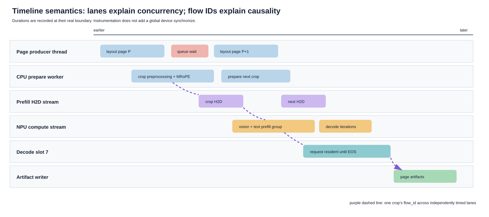

The timeline recorder adds host timestamps and reuses synchronization points
that already exist for correctness. It does not add extra device-wide
synchronization.

Events identify both a logical row and a physical track:

| Track | Examples |
| --- | --- |
| Host thread | Page producer, CPU preparation, main scheduler, writer. |
| Queue | Prepared page, CPU-prepared crop, decode-ready request, artifact job. |
| Device stream | Layout, prefill transfer, prefill compute, decode, token copy. |
| Decode slot | Request residency with slot index and epoch. |

Flow ids connect a page or crop across those tracks. Device spans use NPU
events and a reconstructed device clock. Queue spans represent actual waiting.
Generator-driving `next()` scopes are not mislabeled as idle waits.

The self-contained `timeline.html` is the best way to answer questions such as:

- Is the NPU idle because the next page is not prepared?
- Is a crop waiting on CPU work, H2D, a prefill route, or a decode slot?
- Did a large vision group reduce graph calls but delay the oldest crop?
- Is the ready reservoir empty or merely below its low watermark?
- Is page completion waiting on model work or the artifact writer?

### 18. How to read the metrics

The system reports several clocks because no single sum is meaningful in an
overlapped pipeline.

**Setup wall** includes loading and graph setup. It is excluded from page
throughput.

**Run wall** includes the complete durable page run. `pages / run_wall` is the
headline E2E throughput.

**Per-page latency** overlaps across pages and must not be summed to reconstruct
run wall.

**Device stage seconds** are serialized NPU-event durations for a named model
boundary. They are not host latency and do not include time waiting in queues.

**Physical tokens** price the graph shape actually executed. **Real tokens**
price useful prompt or vision rows. Reporting both exposes padding rather than
letting it disappear inside tok/s.

**Decode raw tok/s** includes every physical B-row graph slot. **Effective
decode tok/s** includes only retained post-prefill request tokens. Use both:
raw throughput describes the graph; effective throughput describes the
scheduler plus workload.

---

## Part VI — Architectural boundaries

### 19. Structural mechanisms versus replaceable policies

The easiest way to extend the engine safely is to distinguish what gives the
system its identity from what merely chooses how one stage executes.

The structural mechanisms are:

- page ownership remains outside the recognizer;
- crop requests can progress independently across page boundaries;
- prefill produces a private decode-ready state;
- admission moves that state into a stable physical decode row;
- slot epochs protect asynchronous sampled-token results;
- page completion and durable output remain outside the model scheduler;
- every queue and arena has explicit backpressure.

Replaceable policies include bucket ladders, lookahead size, packing heuristic,
attention backend, graph compilation, kernel fusion, and exact queue
capacities. Those choices can change substantially without changing the
architecture, provided they preserve the surrounding contracts.

This distinction is useful during optimization. A new vision router should not
need a new page assembler. A faster attention kernel should not alter request
ownership. A new decode graph should not redefine what a slot epoch means.

### 20. Source, runtime, and measurement

Three kinds of statement appear in engineering conversations about this
system, and they should remain separate:

1. **Architecture statements** explain ownership, state, and dependency.
2. **Implementation statements** describe how this checkout realizes an
   architectural role.
3. **Performance statements** describe one measured run.

The source is the authority for implementation. Run artifacts are the
authority for performance. Architecture is the model that should make both of
them understandable.

A timing number belongs with its exact command, revision, physical NPU, graph
cache state, input set, and run artifacts. This handbook deliberately avoids
promoting a best run into an architectural fact. Likewise, a queue or graph
that happens to exist in one revision is mentioned here only when it clarifies
an enduring responsibility or boundary.

---

## Appendix A — Component map

| Responsibility | Primary source |
| --- | --- |
| Full benchmark entrypoint and artifact writer | [`scripts/run_omnidocbench_paddlex.py`](../scripts/run_omnidocbench_paddlex.py) |
| Faithful PaddleX page bridge and ownership map | [`pipeline/paddlex_page_bridge.py`](../pipeline/paddlex_page_bridge.py) |
| Layout compatibility guard | [`pipeline/layout_mask_guard.py`](../pipeline/layout_mask_guard.py) |
| Request/result contracts | [`paddleocr_vl/serving/types.py`](../paddleocr_vl/serving/types.py) |
| Run-scoped recognizer, CPU preparation, prefill chain | [`paddleocr_vl/serving/engine.py`](../paddleocr_vl/serving/engine.py) |
| Profile-guided vision route selection | [`paddleocr_vl/serving/vision_router.py`](../paddleocr_vl/serving/vision_router.py) |
| Zero-once prefill KV pool | [`paddleocr_vl/serving/prefill_cache_pool.py`](../paddleocr_vl/serving/prefill_cache_pool.py) |
| Decode arena, admission, D2H ring, hot swap | [`paddleocr_vl/serving/continuous_decode.py`](../paddleocr_vl/serving/continuous_decode.py) |
| Crop resize, patchification, token construction | [`paddleocr_vl/model/preprocessing.py`](../paddleocr_vl/model/preprocessing.py) |
| Vision stage, PromptFA, static buckets | [`paddleocr_vl/model/vision_prefill.py`](../paddleocr_vl/model/vision_prefill.py) |
| Packed text prefill | [`paddleocr_vl/model/text_packed_prefill.py`](../paddleocr_vl/model/text_packed_prefill.py) |
| Static text prefill | [`paddleocr_vl/model/text_prefill.py`](../paddleocr_vl/model/text_prefill.py) |
| Optimized incremental text decode | [`paddleocr_vl/model/text_decode.py`](../paddleocr_vl/model/text_decode.py) |
| Runtime defaults and bucket profiles | [`paddleocr_vl/serving/runtime_defaults.py`](../paddleocr_vl/serving/runtime_defaults.py) |
| OmniDocBench B32/K4096 profile | [`pipeline/omnidocbench_defaults.py`](../pipeline/omnidocbench_defaults.py) |
| Timeline recorder and viewer | [`utils/timeline.py`](../utils/timeline.py), [`utils/timeline_viewer.html`](../utils/timeline_viewer.html) |

## Appendix B — Invariants worth remembering

- One page input produces one captured PaddleX page template.
- Page preparation stays sequential and the handoff queue never exceeds one.
- Every recognition `request_id` has exactly one owner and one completion.
- The oldest crop visible to the vision router is always selected.
- Vision and text padding never increase the logical token count.
- Packed prompts cannot attend across segment boundaries.
- Every decode-ready request owns one exclusive B1 prefill-pool row.
- A prefill-pool row is not reused before its release event.
- Decode slot indices remain stable; only occupants and epochs change.
- A sampled token is applied only to the epoch that launched it.
- Run completion requires zero active prefill leases, zero unfinished requests,
  every page emitted, and every writer future drained.

## Appendix C — Deliberately excluded paths

The main diagrams do not show:

- the diagnostic `run_offline_e2e.py` page assembler;
- CPU or CUDA fallbacks;
- raw-eager comparison paths;
- the rejected packed scratch-cache lease integration;
- network serving, multiple NPUs, or distributed workers;
- hypothetical overlap of prefill and decode compute;
- lab-only decode optimization presets.

Those paths are useful research controls, but adding them to the main
architecture would make the production execution path harder to see.

## Conclusion — the architecture in one sentence

Experiment 09 is a rolling document pipeline wrapped around a persistent
multimodal recognizer: PaddleX discovers and owns page structure, independent
crop requests share prefill and decode machinery, and explicit identity maps
join their unordered completions back into faithful pages.

Most of the code exists to make that sentence true under pressure. Bounded
queues prevent one lifetime from overwhelming another. Private prefill rows and
stable decode slots make state ownership unambiguous. Events and epochs make
asynchrony safe. The timeline makes waiting visible. The result is not merely a
faster offline script; it is a small serving engine whose pieces can be changed
without losing the document semantics around them.
