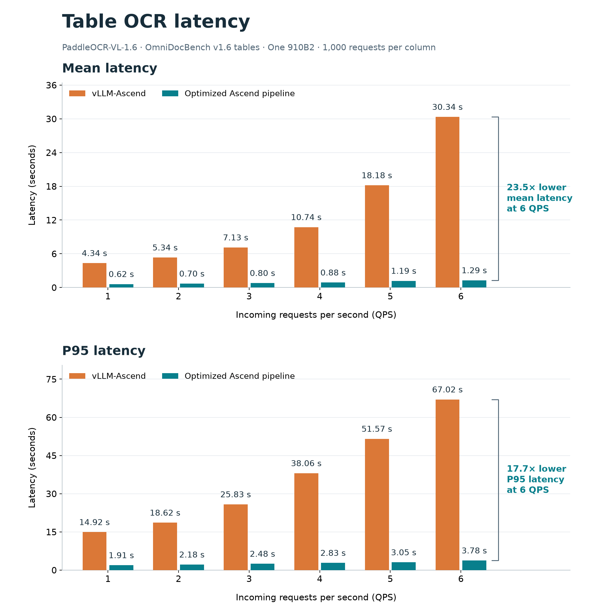

# Low-Latency PaddleOCR-VL Inference on Ascend

## Technology description

PaddleOCR-VL-1.6-0.9B is accelerated on Ascend 910B2 through a specialized inference runtime for low-latency table recognition during document ingestion. The implementation is delivered as a standalone Python HTTP service, with an asynchronous Python interface also available. It accepts individual image crops and returns recognized content, including HTML table structure. Text and formula crops are supported through the same engine.

The runtime keeps the model and compiled graphs resident, continuously batches token generation across incoming requests, and overlaps CPU image preparation and data transfers with NPU execution. It uses the existing model checkpoint without retraining or weight quantization. Recognition quality remains at approximately 95.4% Page-TEDS on the evaluated tables.

Against the graph-enabled vLLM-Ascend reference, the recorded 6-QPS comparison reduces mean end-to-end table latency from 30.34 s to 1.29 s and P95 latency from 67.02 s to 3.78 s: latency ratios of 23.51× and 17.75×, respectively.

## Innovation description

1. **Compiled execution specialized for the recognition model.** Vision prefill, text prefill and autoregressive decoding use cached TorchAir graphs. Instead of padding two dimensions (height and width), we use smart padding, depending only on one dimension (token count). This lets us support any image size, while using a small amount of static compiled graphs, which are faster than dynamic compiled graphs.

2. **Continuous decoding with reusable memory.** A persistent decode batch contains independent requests. When a crop finishes, its slot can accept another crop without waiting for the remaining batch members. Preallocated prefill and decode KV-cache storage is reused, and decoding updates the stored context in place rather than rebuilding it for each token.

3. **Overlapped CPU preparation and NPU communication.** A background CPU thread prepares upcoming images while the NPU processes current work. Pinned host buffers, asynchronous image transfers and asynchronous token copies reduce time spent waiting between stages. Explicit event dependencies preserve safe input lifetimes and cache-slot replacement.

4. **Ascend-oriented vision computation.** Vision attention uses PromptFlashAttention. Attention projections are zero-extended from 72 to 80 dimensions per head, and the MLP width from 4,304 to 4,352, to use hardware-friendly matrix shapes while retaining the original attention scaling and rotary frequencies. Whole-patch convolution is expressed as an equivalent linear projection, and linear weights are prepared in FRACTAL_NZ format before serving.

5. **Optimized repeated token-generation operations.** Packed QKV and gate/up projections consolidate linear operations. Incremental flash attention, in-place KV scatter updates, fused NPU normalization and activation operations, pre-arranged weights as FRACTAL_NZ, and precomputed rotary-position factors reduce repeated work. The decode sequence also prefetches upcoming layer weights and KV data ahead of their use.

6. **Reduced output-head computation.** The optional reduced output head scores 60,416 vocabulary entries instead of 103,424, reducing mean end-to-end latency by approximately 2–3% and P95 latency by 3–6% in the measured table comparisons. It retains actual token IDs generated by full-vocabulary OmniDocBench runs, supplemented with Han-containing tokens and reviewed core language and mathematical tokens. Generated outputs matched the full head exactly in the paired table tests. The original full vocabulary remains available as an option.

7. **Optimized image preparation.** The delivered runtime uses Kornia-RS resizing and prepares image patches as uint8 data, deferring floating-point normalization to the NPU. This reduces CPU preparation work and the amount of image data transferred to the device.

## Performance indicators

Both indicators use **6 incoming requests per second**, with 1,000 table requests from OmniDocBench v1.6 and one Ascend 910B2 per implementation. Both systems receive the same table sequence and Poisson arrival schedule. Latency is measured at the client from request submission to receipt of the response, including service queueing and inference. Startup, compilation and warmup are outside measurement.

```text
Indicator: Mean end-to-end table latency (6 QPS)
Baseline value: 30.34 s
This project: 1.29 s
Industry benchmark: vLLM-Ascend (vLLM 0.23.0, Ascend 910B2)
```

```text
Indicator: P95 end-to-end table latency (6 QPS)
Baseline value: 67.02 s
This project: 3.78 s
Industry benchmark: vLLM-Ascend (vLLM 0.23.0, Ascend 910B2)
```

P95 is the latency within which 95% of requests complete. Ratios are calculated from unrounded measurements. Both runs completed all 1,000 requests without service errors; each had ten generations stopped at the configured KV-cache limit.

The vLLM-Ascend baseline uses FP16, compilation and full/piecewise graph execution, up to 64 sequences, a 16,384-token scheduling budget and a 4,096-token context limit. The optimized comparison uses eight decode slots and a 4,096-token KV-cache limit.

The figures above retain the agreed comparison chart's measurements. That implementation used the earlier 16,384-row vocabulary and Pillow preprocessing. The delivered implementation uses the broader 60,416-row vocabulary and Kornia-RS/uint8 preparation; a subsequent replay of the same 6-QPS workload confirmed slightly lower mean and P95 latency. The numbered optimizations describe the delivered implementation, not isolated measurements of each optimization's contribution.

## Comparison chart


