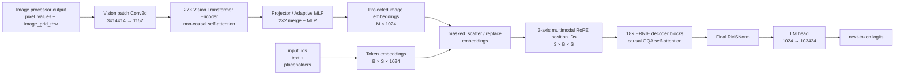

# PaddleOCR-VL-1.6-0.9B Core VLM Inference Architecture Notes

This note explains the **model inference path only** for `PaddlePaddle/PaddleOCR-VL-1.6`. It intentionally excludes the layout detector, page parser, document postprocessing, Markdown/JSON formatting, and application-level pipeline logic.

The core model is a decoder-only multimodal conditional generation model:

```text
PaddleOCRVLForConditionalGeneration
├── visual:  PaddleOCRVisionModel / PaddleOCRVisionTransformer
├── mlp_AR:  Projector, sometimes described as the Adaptive MLP Connector
├── model:   Ernie4_5Model, decoder-only causal LM
└── lm_head: Linear(1024 → 103424)
```

The important architectural point for inference optimization is that this is **not an encoder-decoder model with cross-attention**. Visual features are computed once, projected into the ERNIE hidden space, and then **replace `<image>` token embeddings** inside the decoder input sequence. The decoder then runs normal causal self-attention over one multimodal sequence.

---

## 1. Source-grounded configuration snapshot

### Top-level multimodal LM config

| Field | Value | Meaning for inference |
|---|---:|---|
| `architectures` | `PaddleOCRVLForConditionalGeneration` | HF/Transformers entry point |
| `torch_dtype` | `bfloat16` | Intended inference dtype for weights/activations |
| `hidden_size` | `1024` | Decoder hidden width, `D_lm` |
| `num_hidden_layers` | `18` | ERNIE decoder block count |
| `num_attention_heads` | `16` | Query heads in decoder attention |
| `num_key_value_heads` | `2` | GQA / grouped-query attention KV heads |
| `head_dim` | `128` | Decoder attention head width |
| `intermediate_size` | `3072` | Decoder gated MLP hidden width |
| `hidden_act` | `silu` | Decoder gated MLP activation |
| `vocab_size` | `103424` | LM head output dimension |
| `max_position_embeddings` | `131072` | Long-context RoPE limit |
| `rope_theta` | `500000` | RoPE frequency base |
| `mrope_section` | `[16, 24, 24]` | Multimodal RoPE split for 3-axis position IDs |
| `image_token_id` | `100295` | Placeholder positions replaced by projected image embeddings |
| `vision_start_token_id` | `101305` | Marker before image/video token run |
| `vision_end_token_id` | `101306` | Marker after visual token region |
| `video_token_id` | `101307` | Video placeholder token ID |

### Vision encoder config

| Field | Value | Meaning for inference |
|---|---:|---|
| `vision_config.hidden_size` | `1152` | Vision token width, `D_v` |
| `vision_config.num_hidden_layers` | `27` | Vision transformer encoder block count |
| `vision_config.num_attention_heads` | `16` | Vision attention heads |
| Vision head dim | `1152 / 16 = 72` | Per-head width in vision attention |
| `vision_config.intermediate_size` | `4304` | Vision MLP hidden width |
| `vision_config.patch_size` | `14` | Spatial patch size |
| `vision_config.spatial_merge_size` | `2` | 2×2 merge before entering LM |
| `vision_config.image_size` | `384` | Base learned position embedding grid; interpolated for other grids |
| `vision_config.hidden_act` | `gelu_pytorch_tanh` | Vision MLP activation |
| `vision_config.layer_norm_eps` | `1e-6` | Vision LayerNorm epsilon |

### Image processor defaults relevant to model-facing shapes

| Field | Value | Meaning |
|---|---:|---|
| `patch_size` | `14` | Model patch side length |
| `merge_size` | `2` | Ensures spatial dims are compatible with 2×2 projector merge |
| `max_pixels` | `1003520 = 1280 × 28 × 28` | Default image limit; corresponds to about 5120 vision patches and 1280 projected LM image tokens |
| `min_pixels` | `112896` | Lower image-size bound used by processor |
| `image_mean`, `image_std` | `[0.5, 0.5, 0.5]` | Normalization values in current preprocessor config |
| `rescale_factor` | `1/255` | Pixel scaling before normalization |
| `temporal_patch_size` in preprocessor | `1` | Standard image path emits `T = 1` |

For spotting, the HF model card example raises `max_pixels` to `2048 × 28 × 28`, which increases the projected image-token budget from about `1280` to about `2048` tokens.

---

## 2. End-to-end inference data flow

The inference path has two stages:

1. **Prefill**: run visual encoder + projector + full multimodal decoder sequence.
2. **Autoregressive decode**: run only the decoder on new text tokens while reusing the KV cache. The model’s generation helper explicitly drops `pixel_values` after the first generation step.



---

## 3. Input tensors at the model boundary

For a single-image recognition call, the important tensors passed into `forward(...)` are usually:

| Tensor | Typical dtype | Shape | Notes |
|---|---|---:|---|
| `input_ids` | `torch.int64` | `[B, S]` | Text/chat/task tokens plus `<image>` placeholder tokens |
| `attention_mask` | integer/bool-like tensor | `[B, S]` | Later converted into causal attention mask inside decoder |
| `pixel_values` | usually `float32` from processor, cast to model visual dtype inside `forward` | `[sum_i N_i, 3, 14, 14]` | Flattened image patches, not a full `[B,3,H,W]` image tensor |
| `image_grid_thw` | `torch.int64` | `[num_images, 3]` | Per-image `(T, H_grid, W_grid)` before the 2×2 projector merge |
| `past_key_values` | bf16/fp16/fp32 depending model dtype | per decoder layer | Used after prefill |
| `position_ids` | usually generated internally | `[3, B, S]` | 3-axis multimodal RoPE IDs |

### Why `pixel_values` is patch-shaped

The image processor converts the image to RGB, rescales, normalizes, resizes to a multiple of `patch_size × merge_size = 28`, and reshapes it into flattened 14×14 patches:

```text
resized image:       [3, H_img, W_img]
patch grid:          H_grid = H_img / 14, W_grid = W_img / 14
flattened patches:   [T × H_grid × W_grid, 3, 14, 14]
image_grid_thw:      [T, H_grid, W_grid]
```

For standard image inference, `T = 1`.

---

## 4. Worked shape example

Assume one RGB document crop is resized by the processor to:

```text
H_img = 980, W_img = 1008
patch_size = 14
merge_size = 2
B = 1
```

Both dimensions are multiples of `28`, so they are valid for the 2×2 projector merge.

### Processor output

```text
H_grid = 980 / 14  = 70
W_grid = 1008 / 14 = 72
T      = 1
N      = T × H_grid × W_grid = 1 × 70 × 72 = 5040 raw vision patch tokens

pixel_values.shape    = [5040, 3, 14, 14]
image_grid_thw.shape  = [1, 3]
image_grid_thw[0]     = [1, 70, 72]
```

### Inside `PaddleOCRVLForConditionalGeneration.forward`

The model casts `pixel_values` to the visual module dtype, then adds a leading batch-like dimension:

```text
pixel_values: [5040, 3, 14, 14]
cast:         bf16 if model loaded with torch_dtype=torch.bfloat16
unsqueeze:    [1, 5040, 3, 14, 14]
```

### Vision embedding Conv2d

The patch embedding is:

```text
Conv2d(in_channels=3, out_channels=1152, kernel_size=14, stride=14, padding=valid)
```

Applied independently to each `[3,14,14]` patch:

```text
[1, 5040, 3, 14, 14]
→ reshape internally to [5040, 3, 14, 14]
→ Conv2d output [5040, 1152, 1, 1]
→ flatten to [1, 5040, 1152]
```

Then interpolated/packing position embeddings are added, producing:

```text
vision_hidden_0: [1, 5040, 1152]
```

### Vision transformer encoder

The vision encoder has 27 non-causal transformer encoder layers. Each layer keeps the same shape:

```text
Input to layer ℓ:  [1, 5040, 1152]
LayerNorm:         [1, 5040, 1152]
Q/K/V projections: [1, 16, 5040, 72] for each of Q, K, V
Self-attention:    non-causal over 5040 vision tokens
MLP:               1152 → 4304 → 1152
Output layer ℓ:    [1, 5040, 1152]
```

After the last vision layer and post-layer norm:

```text
vision_features: [5040, 1152]  # often handled as a per-image tensor/list
```

### Adaptive MLP connector / projector

The projector first normalizes each 1152-wide vision token, then merges each 2×2 spatial neighborhood:

```text
Input:       [T × H_grid × W_grid, 1152] = [5040, 1152]
PreNorm:     [5040, 1152]
2×2 merge:   [T × (H_grid/2) × (W_grid/2), 4 × 1152]
             [1 × 35 × 36, 4608] = [1260, 4608]
Linear 1:    4608 → 4608
GELU:        [1260, 4608]
Linear 2:    4608 → 1024
Output:      [1260, 1024]
```

So, in this example, the visual path contributes **1260 decoder image-token embeddings**, not 5040. The 2×2 merge gives a 4× reduction in visual token count before the expensive causal LM.

### Multimodal sequence assembly

Let `P_total` be the count of all non-image tokens in the final prompt, including chat/template/task/special tokens. The decoder sequence length is:

```text
M = projected image tokens = 1260
S = M + P_total
```

For example, if `P_total = 32`:

```text
S = 1260 + 32 = 1292
input_ids.shape      = [1, 1292]
inputs_embeds.shape  = [1, 1292, 1024]
image_embeds.shape   = [1260, 1024]
```

The model embeds all token IDs first:

```text
input_ids → embed_tokens → inputs_embeds: [1, S, 1024]
```

Then it replaces positions where `input_ids == image_token_id` with projected image embeddings:

```text
inputs_embeds[image_token_positions] = image_embeds
```

This replacement is the only point where visual information enters the language model.

---

## 5. Vision encoder block details

Each of the 27 vision layers is a pre-norm transformer encoder layer:

```text
x                  # [B_v, N, 1152]
residual = x
x = LayerNorm(x)
x = non-causal multi-head self-attention(x)
x = residual + x

residual = x
x = LayerNorm(x)
x = MLP(x): Linear(1152 → 4304) → GELU/tanh-style activation → Linear(4304 → 1152)
x = residual + x
```

Important implementation details:

- Vision attention is **non-causal**.
- Vision attention uses 16 heads with head dim `72`.
- The implementation can use eager attention, SDPA, or FlashAttention-style varlen paths depending on the loaded attention implementation and environment.
- In eager mode, attention would form scores with shape `[B, 16, N, N]`, which is very large for `N ≈ 5000`.

For the example above:

```text
N = 5040
attention score elements per vision layer = 1 × 16 × 5040 × 5040 = 406,425,600
bf16 storage if materialized ≈ 812 MB
fp32 storage if materialized ≈ 1.62 GB
```

This is one of the most important places to avoid unfused/eager attention during NPU inference.

---

## 6. Projector details

The projector code corresponds to:

```python
pre_norm: LayerNorm(1152)
2x2 spatial rearrange: 4 neighboring vision tokens concatenated
linear_1: Linear(4608, 4608, bias=True)
act: GELU
linear_2: Linear(4608, 1024, bias=True)
```

For a feature tensor with grid `(T, H, W)`:

```text
Before merge: [T × H × W, 1152]
After merge:  [T × (H/2) × (W/2), 4608]
After MLP:    [T × (H/2) × (W/2), 1024]
```

Equivalent low-level shape transform:

```python
# x: [T*H*W, Dv]
x = x.view(T, H//2, 2, W//2, 2, Dv)
x = x.permute(0, 1, 3, 2, 4, 5)
x = x.reshape(T * (H//2) * (W//2), 4 * Dv)
```

For `Dv = 1152`, `4 * Dv = 4608`.

Optimization note: this is a pure reshape/transpose/reshape plus two linear layers. On torch_npu, check whether the permuted tensor becomes non-contiguous before `linear_1`; forcing or avoiding a materializing contiguous copy can matter.

---

## 7. Decoder-only ERNIE-4.5 LM details

The decoder stack is:

```text
embed_tokens: Embedding(103424, 1024)
18 × Ernie4_5DecoderLayer
final RMSNorm(1024)
lm_head: Linear(1024 → 103424, bias=False)
```

Each decoder layer is pre-norm and causal:

```text
x                  # [B, S, 1024]
residual = x
x = RMSNorm(x)
x = causal grouped-query self-attention(x)
x = residual + x

residual = x
x = RMSNorm(x)
x = gated MLP(x)
x = residual + x
```

### Decoder self-attention shapes

Config:

```text
D_lm = 1024
num_attention_heads = 16
num_key_value_heads = 2
head_dim = 128
num_key_value_groups = 16 / 2 = 8
```

Projection shapes per layer:

```text
x:      [B, S, 1024]
Q proj: Linear(1024 → 16 × 128 = 2048) → [B, 16, S, 128]
K proj: Linear(1024 →  2 × 128 =  256) → [B,  2, S, 128]
V proj: Linear(1024 →  2 × 128 =  256) → [B,  2, S, 128]
RoPE:   applied to Q and K
GQA:    K/V logically repeated from 2 heads to 16 query heads
Attn:   causal over sequence dimension
O proj: Linear(2048 → 1024)
```

In eager attention, the implementation repeats KV heads with `repeat_kv`, making K/V appear as:

```text
K repeated: [B, 16, S, 128]
V repeated: [B, 16, S, 128]
```

An optimized GQA attention kernel should avoid physically materializing this repeat.

### Decoder gated MLP shapes

The MLP is SwiGLU-style:

```text
gate_proj: Linear(1024 → 3072, bias=False)
up_proj:   Linear(1024 → 3072, bias=False)
down_proj: Linear(3072 → 1024, bias=False)
activation: SiLU

MLP(x) = down_proj(SiLU(gate_proj(x)) * up_proj(x))
```

Shape:

```text
x:            [B, S, 1024]
gate_proj(x): [B, S, 3072]
up_proj(x):   [B, S, 3072]
elementwise:  [B, S, 3072]
down_proj:    [B, S, 1024]
```

---

## 8. Multimodal RoPE / position IDs

The model builds multimodal position IDs with shape:

```text
position_ids: [3, B, S]
```

The three axes are:

```text
temporal axis
height axis
width axis
```

For pure text, all three rows are the same 1D sequence positions. For vision tokens, the model assigns positions from the image grid; after vision tokens, text positions start after the maximum visual position.

Relevant config:

```text
use_3d_rope = true
rope_is_neox_style = true
mrope_section = [16, 24, 24]
rope_theta = 500000
```

For images, after projector merge, the LM sees grid:

```text
T_lm = T
H_lm = H_grid / 2
W_lm = W_grid / 2
M    = T_lm × H_lm × W_lm
```

For the worked example:

```text
image_grid_thw before projector = [1, 70, 72]
LM visual grid after projector  = [1, 35, 36]
M = 1260
```

The position IDs for those 1260 image tokens enumerate `(t, h, w)` over that merged grid.

---

## 9. Prefill vs decode step behavior

### Prefill step

Inputs include both image and text:

```text
pixel_values:      [N, 3, 14, 14]
image_grid_thw:    [num_images, 3]
input_ids:         [B, S]
attention_mask:    [B, S]
past_key_values:   None or empty cache
```

The model does:

```text
1. inputs_embeds = embed_tokens(input_ids)                       # [B, S, 1024]
2. image_embeds = visual(pixel_values) → projector(...)          # [M, 1024]
3. replace <image> token embeddings with image_embeds            # [B, S, 1024]
4. position_ids = get_rope_index(...)                            # [3, B, S]
5. run 18-layer decoder with causal mask                         # [B, S, 1024]
6. logits = lm_head(hidden_states)                               # [B, S, 103424]
7. cache stores K/V for each layer                               # per-layer K,V roughly [B, 2, S, 128]
```

### Decode steps after prefill

After the first token generation step, the model generation helper sets:

```text
pixel_values = None
pixel_values_videos = None
```

Then each token step is language-decoder-only:

```text
input_ids:       [B, 1]
inputs_embeds:   [B, 1, 1024]
position_ids:    [3, B, 1]
past_key_values: per-layer cache for prior S + generated tokens
output logits:   [B, 1, 103424]
```

This is critical for optimizing inference: the visual path should run once per request, not once per generated token.

---

## 10. KV-cache size formulas

Because the decoder uses GQA with only 2 KV heads, the KV cache is comparatively small.

Per decoder layer, for `L_cache` cached tokens:

```text
K cache: [B, 2, L_cache, 128]
V cache: [B, 2, L_cache, 128]
```

For bf16/fp16, bytes per cached token per layer:

```text
K+V elements = 2 tensors × 2 KV heads × 128 = 512 elements
bytes/token/layer = 512 × 2 bytes = 1024 bytes
```

For all 18 layers:

```text
bytes/token/all layers = 18 × 1024 = 18,432 bytes ≈ 18 KiB per token, batch 1
```

For a prefill sequence of `S = 1292` and batch 1:

```text
KV cache ≈ 1292 × 18,432 bytes ≈ 23.8 MB
```

This does not include allocator overhead, padding, backend-specific cache layout, logits, temporary attention buffers, or batching.

---

## 11. Activation and compute hotspots

### Vision encoder hotspot

The vision encoder can see up to about:

```text
max raw patch tokens = max_pixels / patch_size²
                     = 1003520 / 196
                     = 5120
```

Then the projector reduces this to:

```text
max projected image tokens = 5120 / 4 = 1280
```

Vision attention over ~5120 tokens is expensive if not fused. Eager attention scores would be:

```text
[B, 16, 5120, 5120]
```

This is much larger than the decoder attention over the projected sequence.

### Decoder prefill hotspot

For `S = 1292`, eager decoder attention scores per layer would be:

```text
[B, 16, 1292, 1292] = 26,708,224 elements
bf16: ~53 MB if materialized
fp32: ~107 MB if materialized
```

Because there are 18 decoder layers, avoiding materialized attention scores is also important.

### Decode hotspot

During autoregressive decode with KV cache, each step is mostly:

```text
18 × decoder layer for S_query = 1
attention reads cached K/V length L_cache
lm_head: [B, 1, 1024] × [1024, 103424]
```

For single-token decode, the `lm_head` can be a noticeable cost because the vocabulary is 103,424.

---

## 12. Dtype behavior

Expected/recommended inference dtype:

```text
model weights: bfloat16
vision activations: bfloat16 after model cast
projector activations: bfloat16, except normalization internals as implemented
LM activations: bfloat16
logits: typically bfloat16 at inference unless loss computation upcasts them
```

Important internal upcasts:

- `Ernie4_5RMSNorm` casts hidden states to `float32`, computes variance/rsqrt, then casts back to input dtype.
- Attention softmax in eager paths is computed in `float32` and cast back to query dtype.
- RoPE frequency/cos/sin generation is computed under disabled autocast / float32-style computation, then returned for use with Q/K.
- If labels are provided for training/eval loss, logits are upcast to float before cross entropy. For generation-only inference, labels should not be provided.

For torch_npu inference, this means bf16 support must be checked not just for matmuls, but also for RMSNorm, RoPE, softmax/attention, `masked_scatter`, and reshape/transpose paths.

---

## 13. torch_npu optimization checklist

This is not a benchmark result, just a model-structure-based checklist.

### Visual path

- Bucket images by `image_grid_thw`, or at least by projected image-token count `M`, to reduce dynamic-shape recompilation.
- Avoid eager/materialized vision attention. The vision encoder can have ~5120 raw patch tokens by default.
- Check whether the current NPU attention implementation supports non-causal variable-length attention efficiently.
- The projector’s 2×2 merge should ideally be view/permute/reshape without extra copies. If a copy is unavoidable, keep it explicit and profile it.
- Projected image embeddings are `[M, 1024]`; if the same image is used for multiple prompts, cache these embeddings outside the decoder prefill path.

### Sequence assembly

- The current implementation uses a mask and `masked_scatter` to place image embeddings into `inputs_embeds`.
- On NPU, profile `masked_scatter`; if it is slow or unsupported, consider building `inputs_embeds` with a more predictable indexed copy path.
- Number of `<image>` placeholders must equal number of projected image embeddings. Mismatch triggers an error.

### Decoder

- Use KV cache. The model is decoder-only; without cache, generated-token cost grows sharply.
- Preserve GQA. Do not expand K/V from 2 heads to 16 heads unless the backend forces it.
- Prefer fused SDPA/GQA attention over eager attention. Eager path uses `repeat_kv` and can materialize large attention scores.
- Cache layout per layer is conceptually `[B, 2, L, 128]` for K and V. Align your cache allocator with the backend’s preferred layout.
- For decode, make sure `pixel_values` is not passed after the first step. The model’s helper already does this when `cache_position[0] != 0`.
- `lm_head` is large: `1024 × 103424`. For small batch decode, vocabulary projection can be a meaningful latency term.

### Compilation / graph capture

- Separate graphs for prefill and decode are likely useful:
  - prefill: dynamic `S`, includes visual path;
  - decode: `S_query = 1`, no visual path, uses KV cache.
- Consider token-count buckets such as projected image tokens `M ∈ {256, 512, 768, 1024, 1280, 2048}` depending on task.
- For spotting, expect larger `M` because the example path uses `2048 × 28 × 28` max pixels.

---

## 14. Minimal mental model

For inference optimization, think of PaddleOCR-VL-1.6-0.9B as:

```text
image patches
  → 27-layer non-causal ViT, hidden 1152
  → 2×2 token reduction + MLP projection to hidden 1024
  → replace image placeholder token embeddings
  → 18-layer ERNIE decoder-only causal GQA LM, hidden 1024
  → LM head over 103424-token vocabulary
```

The critical cost split is:

```text
Prefill cost = vision encoder + projector + full multimodal decoder prefill
Decode cost  = decoder-only single-token steps + LM head + KV-cache reads
```

---

## 15. Primary sources used

- PaddleOCR-VL-1.6 technical report: `https://arxiv.org/abs/2606.03264`
- PaddleOCR-VL-1.6 Hugging Face model card: `https://huggingface.co/PaddlePaddle/PaddleOCR-VL-1.6`
- PaddleOCR-VL-1.6 `config.json`: `https://huggingface.co/PaddlePaddle/PaddleOCR-VL-1.6/blob/main/config.json`
- PaddleOCR-VL-1.6 `modeling_paddleocr_vl.py`: `https://huggingface.co/PaddlePaddle/PaddleOCR-VL-1.6/blob/main/modeling_paddleocr_vl.py`
- PaddleOCR-VL-1.6 `image_processing_paddleocr_vl.py`: `https://huggingface.co/PaddlePaddle/PaddleOCR-VL-1.6/blob/main/image_processing_paddleocr_vl.py`
- PaddleOCR-VL-1.6 `preprocessor_config.json`: `https://huggingface.co/PaddlePaddle/PaddleOCR-VL-1.6/blob/main/preprocessor_config.json`
