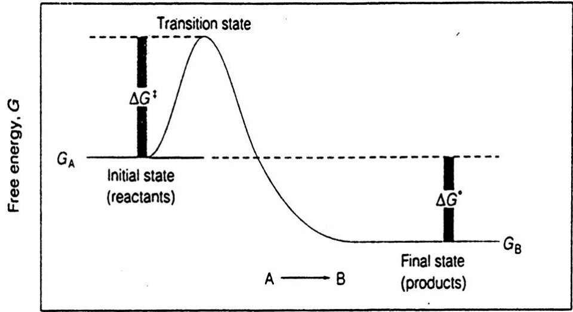

## Activation energy

- Molecules must be activated before they can undergo a reaction

- Reactants must absorb enough energy from surroundings to destabilize chemical bonds (energy of activation)

## Transition state

- Intermediate stage in reaction where the reactant molecule is strained or distorted but the reaction has not yet occurred

