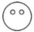
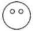
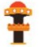
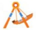
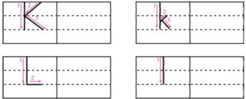

## 小试牛刀

## Read and judge(判断下列句子是否符合所给的情景,用♡或♣表示)

1. 你点着自己的鼻子，你说：This is my ear.

2. 你指着对方的鼻子，你说：This is your nose.

3. 你有一双大眼睛，你说：My eyes are big.

4. 指着自己的红头发，你说：Look. My hair is yellow.

5. 告诉别人，你喜欢苹果，你说：You like apples.

## Learn the letters→见教材P25

<table border=1 style='margin: auto; word-wrap: break-word;'><tr><td style='text-align: center; word-wrap: break-word;'>字母</td><td style='text-align: center; word-wrap: break-word;'>音标</td><td style='text-align: center; word-wrap: break-word;'>运用</td></tr><tr><td style='text-align: center; word-wrap: break-word;'>Kk</td><td style='text-align: center; word-wrap: break-word;'>/k/</td><td style='text-align: center; word-wrap: break-word;'>$ \underline{\text{k}} $ite  $ \underline{\text{K}} $itty  $ \underline{\text{k}} $iss mil $ \underline{\text{k}} $ loo $ \underline{\text{k}} $ bla $ \underline{\text{c}} $ $ \underline{\text{k}} $ stic $ \underline{\text{k}} $ duc $ \underline{\text{k}} $ soc $ \underline{\text{k}} $</td></tr><tr><td style='text-align: center; word-wrap: break-word;'>Ll</td><td style='text-align: center; word-wrap: break-word;'>/l/</td><td style='text-align: center; word-wrap: break-word;'>$ \underline{\text{l}} $ion  $ \underline{\text{l}} $ight  $ \underline{\text{l}} $eg  $ \underline{\text{l}} $emon  $ \underline{\text{l}} $isten  $ \underline{\text{l}} $ove $ \underline{\text{l}} $y  $ \underline{\text{l}} $ive  $ \underline{\text{l}} $ike  $ \underline{\text{l}} $et</td></tr></table>

Look!  $ \downarrow $ A lion!  $ \downarrow $ 看! 一头狮子!

Look !  $ \downarrow $ A kite !  $ \downarrow $ 看! 一只风筝!

Look!  $ \downarrow $ A lion and a kite.  $ \downarrow $ 看！一头狮子和一只风筝。

A big lion and a small kite.  $ \downarrow $一头大狮子和一只小风筝。

## 词汇清单

<table border=1 style='margin: auto; word-wrap: break-word;'><tr><td style='text-align: center; word-wrap: break-word;'>单词</td><td style='text-align: center; word-wrap: break-word;'>音标</td><td style='text-align: center; word-wrap: break-word;'>词性</td><td style='text-align: center; word-wrap: break-word;'>词义</td><td style='text-align: center; word-wrap: break-word;'>运用</td></tr><tr><td style='text-align: center; word-wrap: break-word;'>kite</td><td style='text-align: center; word-wrap: break-word;'>/kaɪt/</td><td style='text-align: center; word-wrap: break-word;'>n.</td><td style='text-align: center; word-wrap: break-word;'>风筝</td><td style='text-align: center; word-wrap: break-word;'>I can fly a kite. 我会放风筝。</td></tr><tr><td style='text-align: center; word-wrap: break-word;'>lion</td><td style='text-align: center; word-wrap: break-word;'>/ˈlaɪən/</td><td style='text-align: center; word-wrap: break-word;'>n.</td><td style='text-align: center; word-wrap: break-word;'>狮子</td><td style='text-align: center; word-wrap: break-word;'>Look at the lion. It&#x27;s so big. 看这头狮子，它好大。</td></tr></table>

## 互动学习

重点讲解·吃透教材

认读和书写：Kk 和 LI 并掌握其基本读音

## 指点迷津·提升能力

字母 K 的发音是清辅音 /k/，声带不振动。发音时舌后部隆起紧贴软腭，憋住气，然后突然分开，气流送出口腔，形成爆破音。

字母 L 的发音是/l/，舌端齿