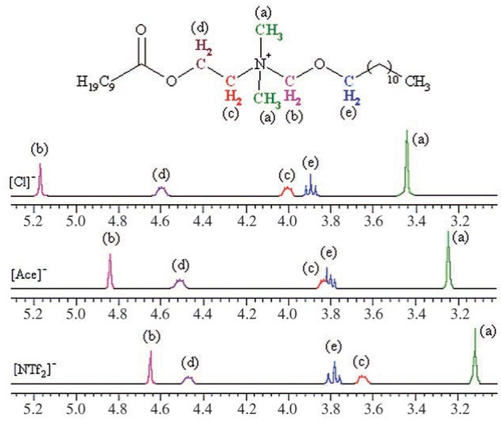
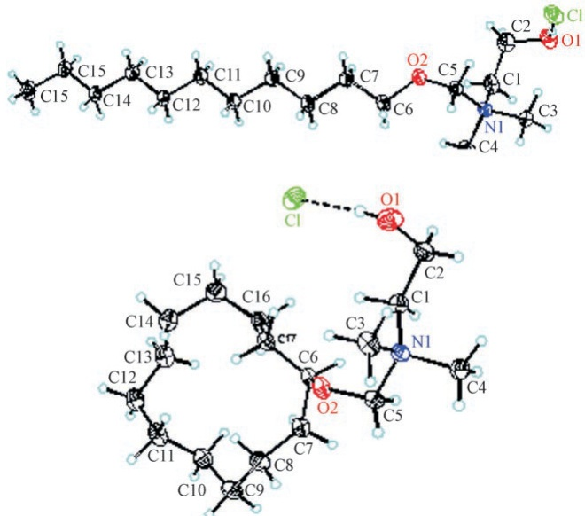
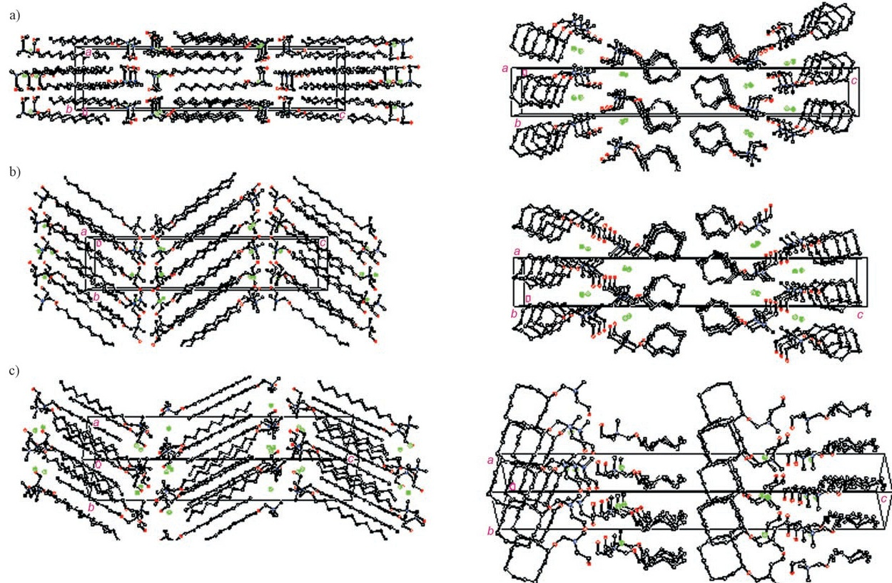

<table border=1 style='margin: auto; word-wrap: break-word;'><tr><td style='text-align: center; word-wrap: break-word;'>No.</td><td style='text-align: center; word-wrap: break-word;'>Group</td><td style='text-align: center; word-wrap: break-word;'>$ [Cl]^{-} $</td><td style='text-align: center; word-wrap: break-word;'>$ [Ace]^{-} $</td><td style='text-align: center; word-wrap: break-word;'>$ [NTf_{2}]^{-} $</td></tr><tr><td style='text-align: center; word-wrap: break-word;'>a</td><td style='text-align: center; word-wrap: break-word;'>$ N(CH_{3})_{2} $</td><td style='text-align: center; word-wrap: break-word;'>3.45 (s)</td><td style='text-align: center; word-wrap: break-word;'>3.25 (s)</td><td style='text-align: center; word-wrap: break-word;'>3.12 (s)</td></tr><tr><td style='text-align: center; word-wrap: break-word;'>b</td><td style='text-align: center; word-wrap: break-word;'>$ CH_{2} $</td><td style='text-align: center; word-wrap: break-word;'>5.17 (s)</td><td style='text-align: center; word-wrap: break-word;'>4.84 (s)</td><td style='text-align: center; word-wrap: break-word;'>4.65 (s)</td></tr><tr><td style='text-align: center; word-wrap: break-word;'>c</td><td style='text-align: center; word-wrap: break-word;'>$ CH_{2} $</td><td style='text-align: center; word-wrap: break-word;'>4.01 (t, J = 4.8)</td><td style='text-align: center; word-wrap: break-word;'>3.82 (t, J = 4.8)</td><td style='text-align: center; word-wrap: break-word;'>3.65 (t, J = 4.8)</td></tr><tr><td style='text-align: center; word-wrap: break-word;'>d</td><td style='text-align: center; word-wrap: break-word;'>$ CH_{2} $</td><td style='text-align: center; word-wrap: break-word;'>4.55 (t, J = 4.8)</td><td style='text-align: center; word-wrap: break-word;'>4.51 (t, J = 4.8)</td><td style='text-align: center; word-wrap: break-word;'>4.47 (t, J = 4.8)</td></tr><tr><td style='text-align: center; word-wrap: break-word;'>e</td><td style='text-align: center; word-wrap: break-word;'>$ CH_{2} $</td><td style='text-align: center; word-wrap: break-word;'>3.89 (t, J = 6.6)</td><td style='text-align: center; word-wrap: break-word;'>3.80 (t, J = 6.6)</td><td style='text-align: center; word-wrap: break-word;'>3.79 (t, J = 6.6)</td></tr></table>

In  $ CDCl_{3} $; s - singlet, t - triplet, J in Hz.

Figure 1. Chemical shifts in proton signals.

monium chloride (1j) and cyclododecyloxymethyl(2-hydroxyethyl)dimethylammonium chloride (1m)—were determined

Figure 2. ORTEP illustrations of the asymmetric units observed for 1j (top) and 1m (bottom); ellipsoids are drawn at the 50% probability level.

(Figure 2). They both display similar packing modes (Figure 3), exhibiting double layers, with the individual cations packed in head-to-head arrangements, although in 1j the long alkyl chains interdigitate while the cyclic alkyl groups in 1m do not. The head-to-head orientations generate hydrophobic regions created by the aliphatic tail groups

Figure 3. Packing diagrams for 1j (left) and 1m (right) viewed down a) the a axis, b) the b axis, and c) the ab diagonal.

