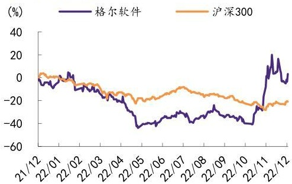

# 数据要素化筑基，信创推动加密需求井喷

# —格尔软件（603232.SH）公司动态研究报告

## 买入(首次)

分析师：宝幼琛 S1050521110002

baoyc@cfsc.com.cn

## 基本数据

2022-12-02

<table border=1 style='margin: auto; word-wrap: break-word;'><tr><td style='text-align: center; word-wrap: break-word;'>当前股价（元）</td><td style='text-align: center; word-wrap: break-word;'>16.55</td></tr><tr><td style='text-align: center; word-wrap: break-word;'>总市值（亿元）</td><td style='text-align: center; word-wrap: break-word;'>38</td></tr><tr><td style='text-align: center; word-wrap: break-word;'>总股本（百万股）</td><td style='text-align: center; word-wrap: break-word;'>232</td></tr><tr><td style='text-align: center; word-wrap: break-word;'>流通股本（百万股）</td><td style='text-align: center; word-wrap: break-word;'>232</td></tr><tr><td style='text-align: center; word-wrap: break-word;'>52 周价格范围（元）</td><td style='text-align: center; word-wrap: break-word;'>9.4-19.88</td></tr><tr><td style='text-align: center; word-wrap: break-word;'>日均成交额（百万元）</td><td style='text-align: center; word-wrap: break-word;'>97.04</td></tr></table>

## 市场表现

资料来源：Wind，华鑫证券研究

## 相关研究

## 投资要点

## 政策加码，信创助推商密建设

2022年，在《密码法》及《信息安全技术信息系统密码应用基本要求》的指导下，各地各行业积极、严谨地开展“商用密码应用安全性评估”工作，关键信息基础设施、政务信息系统、等保三级以上信息系统建设均需过密评。另一方面，行业信创助推商用密码建设，通过构建国产信息系统的软硬件底层架构以及全周期安全生态，国密产品将实现信创软硬件体系的全面适配。随着国家政策持续利好及市场需求日益增加，我国商用密码行业规模整体呈上升趋势，2022年我国商用密码市场规模有望达到708亿元，同比增长31.2%，2023年有望达986亿元，同比增长39.3%，预计至2024年我国商用密码市场规模有望突破千亿。

## 数据要素化筑基，驱动加密需求井喷

数据加密作为数据要素开发与利用的核心技术，产业应用与创新发展已延伸至国家基础设施、金融证券、电力能源、数字经济、数据安全等重要领域。数据确权需要通过数据指纹、数字签名与时间戳技术，构建数据资产的产权证；其次在数据共享中需使用同态加密、多方安全计算等隐私计算技术，实现密文状态下的数据运算处理；资产确权、隐私利用等数据交易全流程均离不开密码技术。此外，在数据要素融通过程中，传统的密码技术结合隐私计算等新型密码技术构筑安全防护边界。在国家大力推动数据要素化的过程中，国产密码有望率先受益。

## 公钥基础设施 PKI 龙头，产品技术领先

公司作为国内公钥基础设施 PKI 龙头，以密码为基石，身份为中心，在身份管理、认证与访问控制、加解密等技术在行业内均处于领先地位，也是国家科技支撑计划商用密码基础设施项目的牵头单位。此外，公司高度重视关键技术自主可控。其中在身份安全方面，零信任智能策略中心发布新版本；密码服务方面，发布了面向政务、央企私有云的多租户密码服务平台；视频安全方面，部署多级联网应用；在车联网方面，产品从身份认证体系迈向车联网数据安全体系；技术研究方面，启动了后量子密码（PQC）迁移的技术储备工作等。随着公司巩固党政、金融优势市场的同时，推进商用密码与行业应用需求的紧密结合，加速其他应用场景落地，公司将进一步打开增长空间。

## 盈利预测

预测公司2022-2024年收入分别为7.86、11.0、15.0亿元，EPS分别为0.43、0.66、0.87元，当前股价对应PE分别为