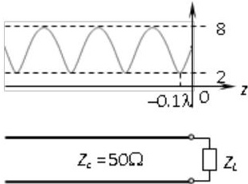

# 浙江大学 20 $ \underline{16} $ - 20 $ \underline{17} $ 学年 $ \underline{\text{春夏}} $学期

# 《电磁场与电磁波》课程期中考试试卷

课程号：___，开课学院：___

考试形式：一纸开卷，允许带一张 A4 大小手写稿入场

考试日期： $ \underline{2016} $年 $ \underline{4} $月 $ \underline{26} $日，考试时间： $ \underline{120} $分钟（14:00-16:00）

诚信考试，沉着应考，杜绝违纪。

考生姓名：___ 学号：___ 所属专业：___

<table border=1 style='margin: auto; word-wrap: break-word;'><tr><td style='text-align: center; word-wrap: break-word;'>题序</td><td style='text-align: center; word-wrap: break-word;'>一</td><td style='text-align: center; word-wrap: break-word;'>二</td><td style='text-align: center; word-wrap: break-word;'>三</td><td style='text-align: center; word-wrap: break-word;'>四</td><td style='text-align: center; word-wrap: break-word;'>五</td><td style='text-align: center; word-wrap: break-word;'>六</td><td style='text-align: center; word-wrap: break-word;'>七</td><td style='text-align: center; word-wrap: break-word;'>总分</td></tr><tr><td style='text-align: center; word-wrap: break-word;'>得分</td><td style='text-align: center; word-wrap: break-word;'></td><td style='text-align: center; word-wrap: break-word;'></td><td style='text-align: center; word-wrap: break-word;'></td><td style='text-align: center; word-wrap: break-word;'></td><td style='text-align: center; word-wrap: break-word;'></td><td style='text-align: center; word-wrap: break-word;'></td><td style='text-align: center; word-wrap: break-word;'></td><td style='text-align: center; word-wrap: break-word;'></td></tr><tr><td style='text-align: center; word-wrap: break-word;'>评卷人</td><td style='text-align: center; word-wrap: break-word;'></td><td style='text-align: center; word-wrap: break-word;'></td><td style='text-align: center; word-wrap: break-word;'></td><td style='text-align: center; word-wrap: break-word;'></td><td style='text-align: center; word-wrap: break-word;'></td><td style='text-align: center; word-wrap: break-word;'></td><td style='text-align: center; word-wrap: break-word;'></td><td style='text-align: center; word-wrap: break-word;'></td></tr></table>

## 一、 选择题（每题2分，共20分）：

1. 传输线特征阻抗为  $ Z_0 $，负载阻抗为  $ R_L $，且  $ Z_0 \ne R_L $，若用特性阻抗为  $ Z_{01} $ 的 1/4 波长阻抗变换器进行匹配，则  $ Z_{01} $ 应满足条件 （ ）.

A.  $ Z_{01} = Z_0 R_L $  B.  $ Z_0 = \sqrt{Z_{01} R_L} $  C.  $ Z_{01} = \sqrt{Z_0 R_L} $  D.  $ Z_{01} = R_L $

2. 一圆极化波垂直投射于一理想导体平板上（平板和 z 轴垂直，位于 z=b），入射电场  $ \mathbf{E} = E_m \left( \mathbf{x}_0 + j \mathbf{y}_0 \right) e^{-jkz} $，则反射波电场为（C）

A.  $ \mathbf{E} = E_m \left( \mathbf{x}_0 + j \mathbf{y}_0 \right) e^{-jkz} $

B.  $ \mathbf{E} = -E_m \left( \mathbf{x}_0 + j \mathbf{y}_0 \right) e^{jk(z-b)} $

C.  $ \mathbf{E} = -E_m \left( \mathbf{x}_0 + j \mathbf{y}_0 \right) e^{jk(z-2b)} $

D.  $ \mathbf{E} = -E_m \left( \mathbf{x}_0 + j \mathbf{y}_0 \right) e^{jkz} $

3. 一容性负载经过四分之一阻抗变换器后，在导纳圆图上标注在（ B）。

A) 上半圆 B) 下半圆 C) 纯电纳圆 D) 纯电导线

4. 右图所示为传输线上电压的驻波分布，判别负载  $ Z_{L} $ 是什么性质的阻抗？

( B )

A. 纯电阻 B. 电阻、电容都有

C. 纯电抗 D. 电阻、电感都有

5. 已知天线的方向性为1.25，天线效率为80%，则天线增益为（C）

A. 0 dB B. 1 dB C. 2 dB D. 3 dB

6. 均匀平面波的电场为  $ \vec{E} = \hat{x} E_0 \sin(\omega t - kz + \pi/6) + \hat{y} E_0 \cos(\omega t - kz) $，则表明此波是（C）