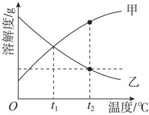
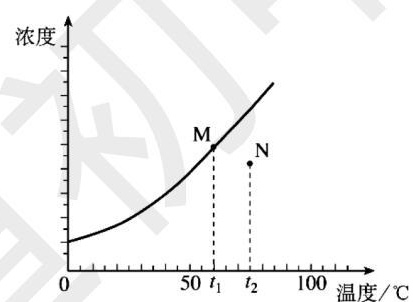

【例题2】实验得到甲、乙的溶解度曲线如图，将 $ t_2^\circ\text{C} $甲、乙的饱和溶液分别降温到 $ t_1^\circ\text{C} $。下列说法一定正确的是（ ）

A. 甲溶液仍饱和

B. 两溶液仍饱和

C. 溶质质量分数：甲=乙

D. 溶液质量：甲=乙

【例题3】某固体溶解度随温度变化的曲线。该固体从溶液中析出时不带结晶水。M、N两点分别表示该固体形成的两份溶液在不同温度时的浓度。当条件改变时，溶液新的状态在图中对应的点的位置可能也随之变化，其中判断正确的是（）

A. 升温  $ 10^{\circ} $C 后，M 点沿曲线向上移，N 点向右平移。

B．加水稀释（假设温度都不变）时，M、N点均不动。

C．都降温10℃后，M点沿曲线向左下移，N点向左平移。

D. 蒸发溶剂（假设温度不变）时，先是 M 点不动，N 点左平移至曲线；继续蒸发溶剂，M、N 点都不动。