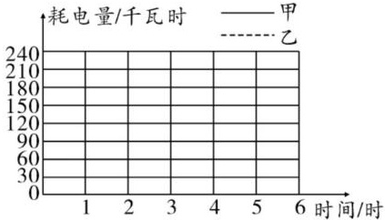
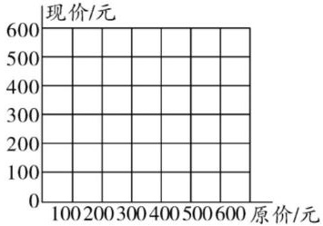
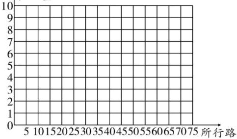

## 第三课时 练习课

## 一、 甲、乙两台机器的工作时间和耗电量如下表：

<table border=1 style='margin: auto; word-wrap: break-word;'><tr><td style='text-align: center; word-wrap: break-word;'>时间/时</td><td style='text-align: center; word-wrap: break-word;'>1</td><td style='text-align: center; word-wrap: break-word;'>2</td><td style='text-align: center; word-wrap: break-word;'>3</td><td style='text-align: center; word-wrap: break-word;'>4</td><td style='text-align: center; word-wrap: break-word;'>5</td><td style='text-align: center; word-wrap: break-word;'>6</td></tr><tr><td style='text-align: center; word-wrap: break-word;'>甲机器耗电量/千瓦时</td><td style='text-align: center; word-wrap: break-word;'>30</td><td style='text-align: center; word-wrap: break-word;'>60</td><td style='text-align: center; word-wrap: break-word;'>90</td><td style='text-align: center; word-wrap: break-word;'>120</td><td style='text-align: center; word-wrap: break-word;'>150</td><td style='text-align: center; word-wrap: break-word;'>180</td></tr><tr><td style='text-align: center; word-wrap: break-word;'>乙机器耗电量/千瓦时</td><td style='text-align: center; word-wrap: break-word;'>30</td><td style='text-align: center; word-wrap: break-word;'>90</td><td style='text-align: center; word-wrap: break-word;'>120</td><td style='text-align: center; word-wrap: break-word;'>180</td><td style='text-align: center; word-wrap: break-word;'>210</td><td style='text-align: center; word-wrap: break-word;'>240</td></tr></table>

1. 根据表中数据，在图中描出工作时间和耗电量所对应的点，再把它们按顺序连起来。

2. 根据画出的图像，( )机器的工作时间和耗电量成正比例。

3. 根据图像判断，工作2.5小时，甲机器的耗电量是( )千瓦时。

## 二、 某商场的商品全部打九折出售。

1. 完成下表：

<table border=1 style='margin: auto; word-wrap: break-word;'><tr><td style='text-align: center; word-wrap: break-word;'>原价/元</td><td style='text-align: center; word-wrap: break-word;'>100</td><td style='text-align: center; word-wrap: break-word;'>200</td><td style='text-align: center; word-wrap: break-word;'>300</td><td style='text-align: center; word-wrap: break-word;'>400</td><td style='text-align: center; word-wrap: break-word;'>500</td></tr><tr><td style='text-align: center; word-wrap: break-word;'>现价/元</td><td style='text-align: center; word-wrap: break-word;'></td><td style='text-align: center; word-wrap: break-word;'></td><td style='text-align: center; word-wrap: break-word;'></td><td style='text-align: center; word-wrap: break-word;'></td><td style='text-align: center; word-wrap: break-word;'></td></tr></table>

2. 完成下图：

3. 如果用 x 表示原价，y 表示现价，那么 y= ___，现价与原价是否成正比例？为什么？

## 三、 下面是某种汽车所行路程和耗油量的对应数值表。

<table border=1 style='margin: auto; word-wrap: break-word;'><tr><td style='text-align: center; word-wrap: break-word;'>所行路程/km</td><td style='text-align: center; word-wrap: break-word;'>15</td><td style='text-align: center; word-wrap: break-word;'>30</td><td style='text-align: center; word-wrap: break-word;'>45</td><td style='text-align: center; word-wrap: break-word;'>75</td></tr><tr><td style='text-align: center; word-wrap: break-word;'>耗油量/L</td><td style='text-align: center; word-wrap: break-word;'>2</td><td style='text-align: center; word-wrap: break-word;'>4</td><td style='text-align: center; word-wrap: break-word;'>6</td><td style='text-align: center; word-wrap: break-word;'>10</td></tr></table>

1. 根据上表描点，再顺次连接各点。

↑耗油量/L

程/km

2. 表中的耗油量与所行路程成正比例吗？为什么？

3. 利用图像估算一下，汽车行驶 60 km 时的耗油量是多少升？耗油量是 5 L 时，汽车能行驶多少千米？