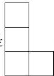
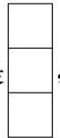
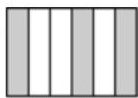
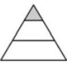
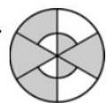
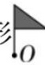
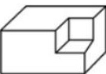

# 期末达标测试卷

RJ · 数学 · 五年级（下）

测试内容：第一～八单元

时间：90分钟 满分：100分+10分

<table border=1 style='margin: auto; word-wrap: break-word;'><tr><td style='text-align: center; word-wrap: break-word;'>题号</td><td style='text-align: center; word-wrap: break-word;'>一</td><td style='text-align: center; word-wrap: break-word;'>二</td><td style='text-align: center; word-wrap: break-word;'>三</td><td style='text-align: center; word-wrap: break-word;'>四</td><td style='text-align: center; word-wrap: break-word;'>五</td><td style='text-align: center; word-wrap: break-word;'>六</td><td style='text-align: center; word-wrap: break-word;'>附加题</td><td style='text-align: center; word-wrap: break-word;'>总分</td></tr><tr><td style='text-align: center; word-wrap: break-word;'>得分</td><td style='text-align: center; word-wrap: break-word;'></td><td style='text-align: center; word-wrap: break-word;'></td><td style='text-align: center; word-wrap: break-word;'></td><td style='text-align: center; word-wrap: break-word;'></td><td style='text-align: center; word-wrap: break-word;'></td><td style='text-align: center; word-wrap: break-word;'></td><td style='text-align: center; word-wrap: break-word;'></td><td style='text-align: center; word-wrap: break-word;'></td></tr></table>

## 一、 认真思考，我会填。（26分）

1. 图形变换的三种方式分别是( )、( )和( )。

 $ \frac{7}{8}=\frac{21}{()}=14\div()=( ) $（填小数）

3. 把1米长的绳子平均分成5段，每段是( )米，每段占全长的( )。

4. 在( )里填上最简分数。

 $$ 300\  千克 =(\quad) 吨 \quad\quad49\  分 =(\quad) 时 $$ 

 $$ 250mL=\left(\right)L\quad280\  米 \left(\right.\left(\quad\right) 千米 $$ 

 $$ 4500\  平方米 =(\quad\text{Ⅰ }) 公顷 \quad350\  平方分米 =(\quad\text{Ⅱ }) 平方米 $$ 

5.18 和 27 的最大公因数是( ),最小公倍数是( )。

6. 一个棱长是 9 厘米的正方体可以切成( )个棱长是 3 厘米的小正方体。

7. 一个几何体从上面看是☐，从正面看是☐，从左面看是☐，这个几何体是由( )个小正方体搭成的。

8.有19瓶水，其中有18瓶质量相同，另有1瓶是盐水，比其他的水稍重一些，至少称( )次可以保证找出这瓶盐水。

9. 把一个长 15cm 的长方体木块沿横截面分成两个小长方体木块，表面积比原来增加了  $ 4.8cm^{2} $，这个长方体木块原来的体积是( )cm $ ^{3} $。

10. 在○里填上“＞”“＜”或“＝”。

35 秒○ $ \frac{7}{12} $分 \quad 1080L ○ 1080m $ ^3 $ \quad  $ \frac{7}{8} $○ $ \frac{17}{20} $

125cm $ ^3 $ ○ $ \frac{1}{8} $L \quad  $ \frac{1}{3} $○ $ \frac{4}{9} $ \quad  $ \frac{2}{3} $+ $ \frac{2}{5} $○ $ \frac{4}{5} $+ $ \frac{1}{3} $

## 二、 仔细推敲，我会判。（5分）

1. 一个非零自然数，不是质数就是合数。 （）

2. 把分数的分子和分母同时加上 4, 分数的大小不变。 （）

3. 图形旋转时，它的位置、方向、大小都没有变化。 （）

4. 一项工作，甲用了0.35小时完成，乙用了 $ \frac{11}{25} $小时完成，甲做得快些。 （）

5. 从折线统计图中能看出数量的增减变化情况。 （）

## 三、 细心比较，我会选。（10分）

1. 下面表示 $ \frac{2}{3} $的是( )。

A.

B.

C.

2. 在 50 以内的数中，5 和 15 的公倍数有( )个。

A. 1

B. 2

C. 3

3. 把图形绕着点 O 逆时针旋转  $ 90^{\circ} $ 后，得到的图形是( )。

A.  $ \overrightarrow{O} $

B.  $ \overrightarrow{C} $

C.  $ \triangle $

4.  $ \frac{7}{9}+\frac{3}{10}+\frac{2}{9}+\frac{17}{10}=(\frac{7}{9}+\frac{2}{9})+(\frac{3}{10}+\frac{17}{10}) $ 应用了（）。

A. 加法交换律 B. 加法结合律 C. 加法交换律和加法结合律

5. 一个长方体被挖去一小块(如下图)，下面说法完全正确的是( )。

A. 体积减小，表面积也减少

B. 体积减小，表面积增加

C. 体积减小，表面积不变

## 四、 看清题目，我会算。（26分）

1. 看谁算得又对又快。(8分)

 $$ 1-\frac{9}{10}=\quad\frac{4}{3}+\frac{2}{3}=\quad\frac{1}{5}-\frac{1}{6}=\quad\frac{6}{7}-\frac{1}{2}+\frac{1}{7}= $$ 

 $$ \frac{1}{5}+\frac{3}{5}=\quad\frac{11}{12}-\frac{1}{3}=\quad\frac{7}{9}-\frac{2}{9}=\quad1-\frac{2}{19}-\frac{17}{19}= $$ 