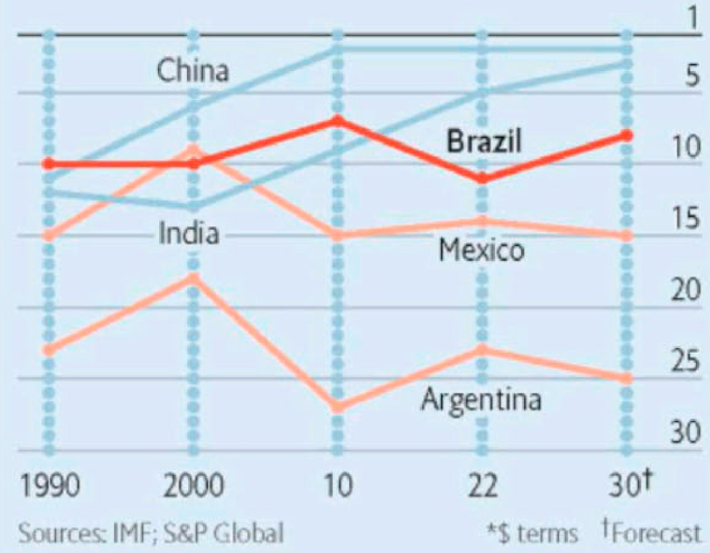

Yet Lula has undermined his administration's successes with unscripted remarks, and a naive desire to appear chummy with autocrats and democrats alike.

Shortly before foreign ministers gathered in Rio, Lula was touring Egypt and Ethiopia. Both had recently joined the BRICS, a group of emerging economies, and Lula was promoting Brazil as a leader for the global south. But it was his inflammatory statements at a press conference in Addis Ababa on February 19th that made headlines. "What is happening in Gaza and to the Palestinian people has not existed at any other time in history," he said, adding erroneously, that "actually, it has existed: when Hitler decided to kill the Jews".

Israel immediately declared Lula to be a “persona non grata” and summoned Brazil’s ambassador to the Holocaust Museum in Jerusalem for a reprimand. Hamas, the Palestinian Islamist group which runs Gaza, praised his comments as “accurate”.

He is strikingly less keen to judge other countries. When asked at the same press conference about Alexei Navalny, the Russian opposition leader who died on February 16th in the Arctic penal colony to which Mr Putin had banished him, he demurred. "Why the rush to accuse someone? A citizen died in prison; I don't know if he was ill or had any issues."

It was not Lula's first display of sympathy towards Mr Putin's regime. He has blamed Ukraine for being invaded by Russia. In September he said Mr Putin would not be arrested if he attended the G20 summit, though he later walked back the comment (a warrant from the International Criminal Court obliges Brazil's courts to detain Mr Putin). This attitude differs little from that of his predecessor, who visited Mr Putin one week before Russia invaded Ukraine. Brazil has become the world's biggest buyer of Russian diesel.

## Gift of the gaffe

The most generous interpretation is that remarks of this kind are a cynical ploy to galvanise the leftist base of Lula's Workers' Party. Even if that is working, it is having severe side-effects. As well as irking Western allies, Lula has forged common ground on which Brazil's right wing and alienated centrists have come together.

On February 25th Mr Bolsonaro called on his followers to march in São Paulo against an investigation into his role in the events of January 8th 2023, when his supporters attempted to overturn the results of the presidential election. Mr Bolsonaro and thousands of his fans, many of whom are evangelical Christians who support Israel, arrived at the march draped in Israeli flags. Senators and congressmen who had been attempting to avoid association with Mr Bolsonaro felt compelled to show up in the wake of Lula's outburst.

Returning to growth

Ranking of world's largest countries

by nominal GDP $ ^{*} $

These inconsistencies risk weakening the overall effect of Lula's foreign policy, says Rubens Ricupero, a former Brazilian ambassador. Lula wants Brazil to be all things to all people: a friend of the West and a leader of the global south, a defender of the environment and a global oil power, a promoter of peace and an ally for auto-crats. Brazil may well be back, but the part it is playing on the world stage is murkier than it should be.

War on drugs

# The switcheroo

MIAMI

A former us ally and Honduran president is tried for drug trafficking

T HE UNITED STATES has long struggled to find reliable allies in the so-called war on drugs. Take former Honduran president, Juan Orlando Hernández. Once feted in Washington as a partner in the struggle against the flow of narcotics, on February 20th he found himself in the dock in New York, standing trial for his alleged role in a drug-trafficking conspiracy that has run on for more than a decade.

In a 96-page document laying out their case against the former president, federal prosecutors say that Mr Hernández had merely “pretended to support the United States’ efforts to curb drug trafficking”, and had in fact been conspiring with drug lords to finance his political campaigns. Mr Hernández has strongly denied the accusations. He says they are lies made up by convicted traffickers looking to reduce their sentences in exchange for co-operation with prosecutors.

The case raises the question of why it is hard for the United States to find trustworthy allies in the war on drugs. Recent examples of apparent duplicity abound. In 2020, US officials arrested former Mexican defence minister General Salvador Cienfuegos, on charges of colluding with organised crime (the charges were dropped after Mexico threatened to restrict US Drug Enforcement Administration operations in Mexico). Mexico's former Secretary of Public Security, Genaro García Luna, was convicted in February last year of colluding with the Sinaloa syndicate during his time in office, between 2006 and 2012. At sentencing, he faces a minimum of 20 years in jail. Before his arrest, Mr García Luna was heralded as a "Supercop" who worked closely with US officials.

The waning popularity of the war on drugs is one part of the problem. That US allies question its commitment to the drug war at home is another. They cite the insatiable market for illegal drugs and the sale of guns to organised crime groups across Latin America. This has encouraged a soft-er stance on drugs across the region.

In Mexico, President Andrés Manuel López Obrador has broken with his predecessors' militarisation of the drug war, adopting what he calls a “hugs, not bullets” policy in an effort to reduce the country's astronomical homicide rate. While still cooperating with the United States, Mr López Obrador complains that DEA operations in Mexico abuse its sovereignty. When old DEA reports were leaked in January, alleging that Mr López Obrador's presidential campaign may have received financing from drug gangs, he responded by slamming the United States for running unsanctioned operations in the first place, denouncing such “immoral practices”.

Things are no better in Colombia, which produces about 60% of the world's coca, the crop which is processed to make cocaine. Its leftist president Gustavo Petro is an open critic of the drug war, and has cut back on the eradication of coca crops.

The United States' record of working with unsavoury characters (most famously expressed in President Franklin D. Roosevelt's apocryphal remark that Nicaraguan dictator Anastasio Somoza García "may be a son of a bitch, but he's our son of a bitch") may also offer foreign leaders and officials a false sense of security.

“There is something very appealing about being considered one of the good guys. That is what the US sells,” said John Feeley, a retired US ambassador who served most of his career in Latin America. Visiting the White House and receiving delegations of powerful US officials can bolster a leader’s image at home.

Honduras was a priority in the drug war due to its role as an “air bridge” for flights carrying cocaine from South America to the United States. The corruption and violence associated with drug trafficking turned the country into one of the most violent places in the world, and fuelled migration to the United States.