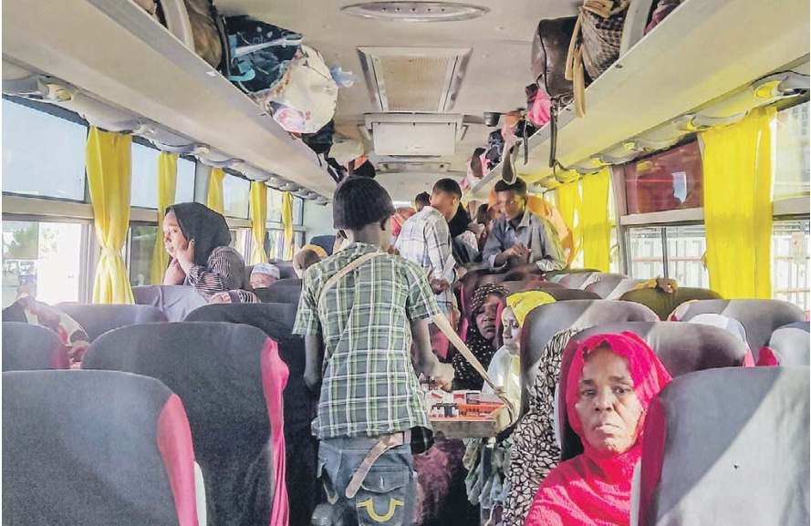

# U.S. says genocide under way in Sudan

Secretary of State

announces sanctions

against RSF commander,

and seven companies

controlled by the militia

GEOFFREY YORK

AFRICA BUREAU CHIEF

JOHANNESBURG

Sudan’s powerful Rapid Support Forces militia has committed genocide by systematically perpetrating murder and sexual violence against adults and children from minority ethnic groups, the United States says.

People displaced by conflict in Sudan ride aboard a bus Tuesday to return home to the southern city of Singah in Sennar province, which was retaken by the Sudanese army forces from the Rapid Support Forces in November, 2024. AFP VIA GETTY IMAGES

The long-awaited genocide declaration had been contemplated by the Joe Biden administration for many months, but it was finally announced on Tuesday as one of the administration's last acts, less than two weeks before Mr. Biden hands over the presidency to Donald Trump.

“The RSF and allied militias have systematically murdered men and boys – even infants – on an ethnic basis, and deliberately targeted women and girls from certain ethnic groups for rape and other forms of brutal sexual violence,” U.S. Secretary of State Antony Blinken said in a statement.

“Those same militias have targeted fleeing civilians, murdering innocent people escaping conflict, and prevented remaining civilians from accessing lifesaving supplies,” he said. “Based on this information, I have now concluded that members of the RSF and allied militias have committed genocide in Sudan.”

The Biden administration also announced sanctions against the RSF's long-time commander, General Mohamed Hamdan Dagalo, known as Hemedti, along with seven companies controlled by the RSF in the United Arab Emirates, a wealthy Gulf state that is reportedly supplying weapons to the paramilitary

The war in Sudan, which erupted 21 months ago in a power struggle between the RSF and the Sudanese military, has killed tens of thousands and triggered the world's biggest humanitarian catastrophe. More than 12 million people have been forced from their homes and 30 million are in dire need of emergency aid.

Several of the UAE-based companies were providing weapons or money to the RSF, while another was buying gold from the RSF's mining operations in Sudan, the U.S. Treasury Department said in its sanctions decision.

group.

A year ago, Mr. Blinken said the RSF and the Sudanese military had both committed war crimes. But he had delayed his decision on a genocide declaration, reportedly because it could have triggered an RSF pullout from ceasefire negotiations, which ultimately failed. He may have calculated that Mr. Trump is unlikely to focus on Sudan in the early months of his presidency, so the genocide declaration and sanctions against Gen. Dagalo will be the last chance for Washington to apply pressure on the RSF for the foreseeable future.

Last year, U.S. envoy Tom Perriello said the Sudan war had killed as many as 150,000 people. His estimate was reinforced by a British study, which found that 61,000 people had died in Khartoum alone in the first 14 months of the war.

Sudan is also the site of the world's only officially declared famine. Late last month, an expert committee said the famine had expanded to five areas of the country, with more than 630,000 people at risk of starvation and a further five areas likely to fall into famine by May.

Tuesday’s announcement is the second time in 21 years that the United States has declared the existence of a genocide in Sudan. The previous declaration, in 2004, focused on the RSF’s predecessor, known as the Janjaweed, which committed widespread atrocities in the Darfur region of western Sudan to suppress a rebellion. Despite the evidence of genocide, the RSF was later brought into Sudan’s government and built a vast arsenal of weapons and fighters.

Human rights groups welcomed the U.S. announcement. "RSF leader General Hemedti is ultimately responsible for some of the most heinous atrocities being committed anywhere in the world today," said John Prendergast, co-founder of The Sentry, a U.S.-based watchdog group that focuses on Sudan and South Sudan.

“Without serious measures of legal and financial accountability, the RSF will continue its rampage,” he said.

The Montreal-based Raoul Wallenberg Centre for Human Rights said the sanctions were “a significant step toward justice.” It called on Canada and other countries to impose similar sanctions on Gen. Dagalo.

Some critics noted that the U.S. announcement came more than eight months after the Wallenberg Centre had made a similar finding of genocide, based on its own research on the killings in Darfur. Wallenberg Centre legal adviser Mutasim Ali, in a social media post, said the U.S. decision to make the genocide declaration "should have been taken sooner."

Cameron Hudson, an Africa analyst at the U.S.-based Center for Strategic and International Studies, said the U.S. announcement was long overdue. In a social media post, Mr. Hudson said the sanctions and genocide declaration will make it harder for the RSF to position itself as a legitimate political actor in postwar Sudan.

In recent days, the RSF has been working on a plan to establish a government in the territory that it controls – mainly Darfur and some sections of Khartoum and east-central Sudan. This government, operating parallel to Sudan's official government, could pave the way for an unofficial partition of the country, similar to the situation in neighbouring Libya, where two rival governments are operating.

# AU LIT FINE LINENS

The JANUARY SALE

BEDDING + PILLOWS & DUVETS + BATH + BEDROOM FURNITURE $ ^{NEW} $!

We change the way you sleep.

147 TYCOS DRIVE, TORONTO + 2049 YONGE STREET, TORONTO

WWW.AULITFINELINENS.COM