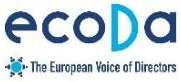
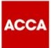

Beyond traditional corporate governance: What's the role of the board in fostering sustainability and innovation?

The European Corporate Governance Conference 2021 explored how boards can support the process of long-term value creation.

Boards should make time to reflect on their company's long-term value creation and its role in the global value chain.

▶ Audit committees can assure the reliability of the information used to inform decision-making, making links between financial and sustainability risks.

▶ Sustainable corporate governance will help to drive better risk management, greater innovation and higher levels of transparency.

## Summary

The European Corporate Governance Conference 2021 explored how sustainable corporate governance can help to foster sustainability and long-term value creation. Key topics included the roles of the audit committee and internal audit, sustainability reporting, remuneration policies, supply chain due diligence, competitiveness, innovation and the European Commission's sustainable corporate governance proposal.

## Co-organizers

SLOVENIAN

DIRECTORS' ASSOCIATION

for effective Corporate Governance

## Partners

Think Ahead

EuropeanIssuers