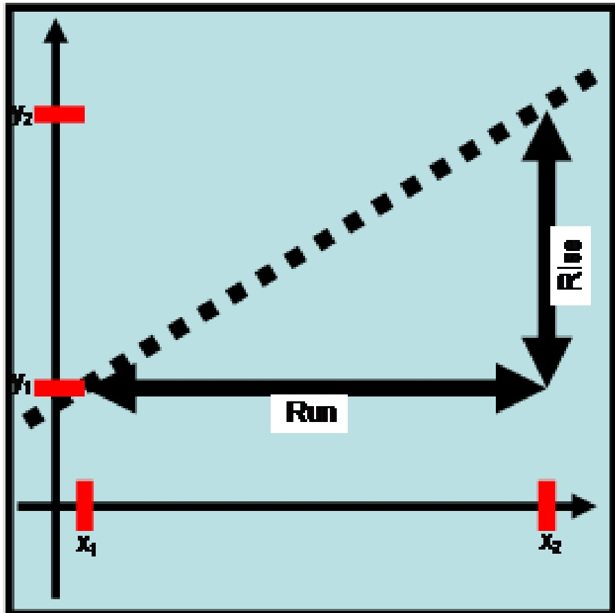

## Slope

• Slope = rise/run

• = $\Delta y/\Delta x$

$$• \mathbf{y_{2}-y_{1}} /(\mathbf{x_{2}-x_{1}} )$$

• Order of points 1 and 2 not critical, but keeping them together is

• Points may lie in any quadrant: slope will work out

• Leibniz notation for derivative based on  $\Delta y/\Delta x$ ; the derivative is written dy/dx

