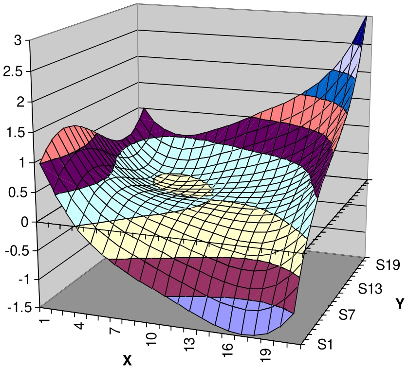

## Partial Derivatives

<table>
<tr>
<td>2.5-3</td>
</tr>
<tr>
<td>$\mdlgblkcircle$2.5</td>
</tr>
<tr>
<td>$\mdlgblkcircle$1.5</td>
</tr>
<tr>
<td>$\mdlgblkcircle$0.5</td>
</tr>
<tr>
<td>$\mdlgblkcircle$-0.5</td>
</tr>
<tr>
<td>$\mdlgblkcircle$-1--0.5</td>
</tr>
<tr>
<td>$\mdlgblkcircle$-1.5-1</td>
</tr>
</table>

• Functions of more than one variable

• Example:  $C(x,y) = x^{4} + y^{3} + xy$

